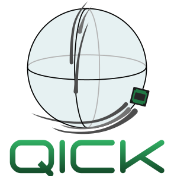

 

# QICK: Quantum Instrumentation Control Kit

The QICK is a kit of firmware and software to use the Xilinx RFSoC to control quantum systems.

It consists of:
* Firmware for the ZCU111, ZCU216, and RFSoC4x2 evaluation boards. We generally recommend using the newer generation of RFSoCs (ZCU216 and RFSoC4x2) for better overall performance.
* The `qick` Python package
* [A quick start guide](quick_start) for setting up your board and running a Jupyter notebook example
* [Jupyter notebook examples](qick_demos) demonstrating usage

Other examples and tutorials (compatibility with the current QICK software is not guaranteed):
* [IEEE Quantum Week 2023](https://github.com/openquantumhardware/QCE2023_public)
* [US QIS Summer School 2024](https://github.com/openquantumhardware/QIS_SummerSchool_2024)

Note: The firmware and software here is still very much a work in progress. This is an alpha release. We strive to be consistent with the APIs but cannot guarantee backwards compatibility.

Announcements
-------------

The QICK group at Fermilab is currently hiring two engineering positions, where the primary focus will be firmware development for QICK.
* [Staff Engineer II](https://fermilab.wd5.myworkdayjobs.com/en-US/FermilabCareers/job/Staff-Engineer-II_R_007999)
* [Senior Engineer](https://fermilab.wd5.myworkdayjobs.com/en-US/FermilabCareers/job/Senior-Engineer_R_007996)

We will be presenting a tutorial at IEEE Quantum Week 2024: https://qce.quantum.ieee.org/2024/program/tutorials-abstracts/#tut21

Download and Installation
-------------------------

Follow the quick start guide located [here](quick_start) to set up your board, install `qick` on your board, and run a Jupyter notebook example.

If you want your board's state to persist between notebooks or scripts, you should install Pyro4 on your board and run QICK in a Pyro server: [Pyro demo](pyro4/00_nameserver.ipynb)

If you would like to save the instrument configuration for every measurement using [QCoDeS](https://microsoft.github.io/Qcodes/), you can also install [this QCoDeS driver](https://github.com/aalto-qcd/qcodes_qick).

If you're interested in using QICK to control and read out NV centers or other quantum defects, you might be interested in [QICK-DAWG](https://github.com/sandialabs/qick-dawg) which extends QICK with pulses and measurement programs specific to that application.

Documentation
-------------

The API documentation for QICK is available at: https://qick-docs.readthedocs.io/

The [demo notebooks](qick_demos) are intended as a tutorial.
The first demos explain important features of the QICK system and walk you through how to write working QICK programs.
The later demos provide examples of useful measurements you might make with the QICK.
We recommend that new users read and understand all of the demos.

Updates
-------

Frequent updates to the QICK firmware and software are made as pull requests.
Each pull request will be documented with a description of the notable changes, including any changes that will require you to change your code.
We hope that this will help you decide whether or not to update your local code to the latest version.
We strive for, but cannot guarantee, bug-free and fully functional pull requests.
We also do not guarantee that the demo notebooks will keep pace with every pull request, though we make an effort to update the demos after major API changes.

Our version numbering follows the format major.minor.PR, where PR is the number of the most recently merged pull request.
This will result in the PR number often skipping values, and occasionally decreasing.
The tagged release of a new minor version will have the format major.minor.0.

Tagged releases can be expected periodically.
We recommend that everyone should be using at least the most recent release.
We guarantee the following for releases:
* The demo notebooks will be compatible with the QICK library, and will follow our current best recommendations for writing QICK programs.
* The firmware images for all supported boards will be fully compatible with the library and the demo notebooks.
* Release notes will summarize the pull request notes and explain both breaking API changes (what you need to change in your code) and improvements (why you should move to the new release).

We recommend that you "watch" this repository on GitHub to get automatic notifications of pull requests and releases.

Contribute
----------

You are welcome to contribute to QICK development by forking this repository and sending pull requests.

All contributions are expected to be consistent with [PEP 8 -- Style Guide for Python Code](https://www.python.org/dev/peps/pep-0008/).

We welcome comments, bug reports, and feature requests via GitHub Issues.

Find us on the [Unitary Fund Discord](http://discord.unitary.fund/): chat with us in the #qick channel or the [weekly office hours](https://www.addevent.com/event/lw18055508).

License
-------
The QICK source code is licensed under the MIT license, which you can find in the LICENSE file.
The [QICK logo](graphics/logoQICK.svg) was designed by Dr. Christie Chiu.

You are free to use this software, with or without modification, provided that the conditions listed in the LICENSE file are satisfied.
