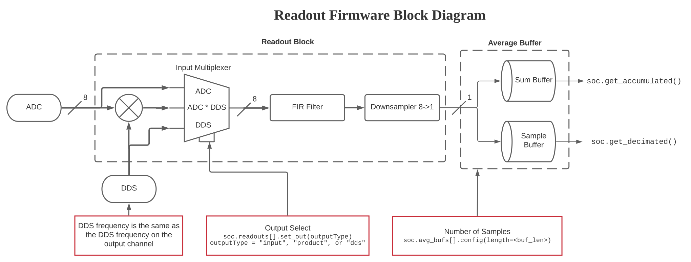

Firmware
========

This page provides an overview of the QICK firmware components. For detailed documentation of the tProcessor, please refer to :doc:`/tprocv2_trm`.

System Overview
---------------

The QICK firmware includes the following components:

* 1 output channel connected to PMOD0-3 and triggers for Readout Block
* 7 output channels connected to DACs (via Signal Generator V4)
* 2 input channels connected to ADCs (via Readout system)
* 1 instance of tProcessor (64-bit instructions, 32-bit registers)

Sampling frequency of ADC blocks is given by the variable ``soc.fs_adc``. Sampling frequency of DACs is stored in variable ``soc.fs_adc``. Fast-speed buffers were removed to save memory space. Raw data can be captured after x8 down-sampling.

Signal Generators (V4)
----------------------

Output channels driving DACs use the **Signal Generator V4**, which has the following features:

* Supports uploading I/Q envelopes
* 32-bit resolution for both frequency and phase
* Configurable DDS with streaming mode (frequency can change sample-to-sample)
* Maximum envelope length given by ``soc.gens[i].MAX_LENGTH``

For detailed information on the control word format, see the example assembly files in the firmware repository.

.. figure:: ../graphics/qsystem-signalgen.svg
   :width: 100%
   :align: center

Readout System
--------------

The readout block is built around two IPs: **Readout** and **Average + Buffer**:

**Readout Block:**
* Digital down-conversion (DDC)
* FIR filtering
* Decimation by 8
* DDS frequency configured via register (not intended for real-time frequency hopping)

**Average + Buffer Block:**
* Can store raw samples
* Can perform sum of specified number of samples
* Process started by external trigger (connected to tProcessor Channel 0)
* Buffer size: ``soc.avg_bufs[i].AVG_MAX_LENGTH``

The user can route the input, the DDS wave, or the frequency-shifted signal to the FIR and decimation stage using an output selection register.

The tProcessor
--------------

The tProcessor (timing Processor) is a hard real-time co-processor inside the QICK FPGA. It runs user-written programs that control waveform generation, data acquisition, and feedback with nanosecond precision.

For **complete documentation**, see:

* :doc:`/tprocv2_trm` - Full reference manual (architecture, instruction set, programming examples)

**Quick links to tProcessor topics:**

* :ref:`tproc-quick-ref` - Most common instructions and condition codes
* :ref:`tproc-registers` - Complete register bank reference
* :ref:`tproc-examples` - Copy-paste ready code examples
* :ref:`tproc-peripherals` - ARITH (multiply), DIV, LFSR
* :ref:`tproc-pitfalls` - Common mistakes and debugging

tProcessor Channel Assignment
-----------------------------

tProcessor output channels (AXIS MASTER) are assigned as follows:

- **Channel 0** : PMOD0 (bits 0-3), readout triggers (bit 14 = ADC 224 CH0, bit 15 = ADC 224 CH1)
- **Channel 1** : Signal Generator V4 → DAC 228 CH0
- **Channel 2** : Signal Generator V4 → DAC 228 CH1
- **Channel 3** : Signal Generator V4 → DAC 228 CH2
- **Channel 4** : Signal Generator V4 → DAC 229 CH0
- **Channel 5** : Signal Generator V4 → DAC 229 CH1
- **Channel 6** : Signal Generator V4 → DAC 229 CH2
- **Channel 7** : Signal Generator V4 → DAC 229 CH3

tProcessor input channels (AXIS SLAVE) for feedback:

- **Channel 0** : Readout 0 (ADC 224 CH0)
- **Channel 1** : Readout 1 (ADC 224 CH1)

.. note::
   If using the Xilinx XM500 daughter board (ZCU111), be aware of filters:
   
   - DAC 229 CH0/CH1: **High-pass** (1 GHz) → output ≥ 1 GHz
   - DAC 229 CH2/CH3: **Low-pass** (1 GHz) → output ≤ 1 GHz
   - ADC 224 CH0/CH1: **Low-pass** (1 GHz) → input ≤ 1 GHz
   - DAC 228 channels: **No filters**

Signal Generator Array
----------------------

Signal Generators are organized in ``soc.gens`` array (7 instances):

.. list-table::
   :header-rows: 1

   * - Array Index
     - tProcessor Channel
     - DAC Channel
   * - 0
     - 1
     - DAC 228 CH0
   * - 1
     - 2
     - DAC 228 CH1
   * - 2
     - 3
     - DAC 228 CH2
   * - 3
     - 4
     - DAC 229 CH0
   * - 4
     - 5
     - DAC 229 CH1
   * - 5
     - 6
     - DAC 229 CH2
   * - 6
     - 7
     - DAC 229 CH3

**Example:** To output on DAC 229 CH1 (tProc Channel 5), use ``soc.gens[4]``.

Average + Buffer Array
----------------------

Average and buffer blocks are organized in ``soc.avg_bufs`` array (2 instances):

- Index 0: Readout 0 (ADC 224 CH0)
- Index 1: Readout 1 (ADC 224 CH1)

Timing
------

- **FPGA clock:** 384 MHz → period = 2.6 ns
- **DAC speed:** 384 × 16 = 6144 MHz → resolution ~163 ps
- **ADC speed:** 384 × 8 = 3072 MHz, decimated by 8 → resolution ~2.6 ns
- **Minimum DAC pulse length:** 16 samples (shorter pulses can be zero-padded)

Firmware Parameters
-------------------

.. list-table::
   :header-rows: 1

   * - Parameter
     - Value
   * - Pulse memory length
     - 65536 per channel ×2 (I/Q) = 128k total
   * - Decimated ADC buffer
     - 1024 samples per component (I,Q) = 2k total
   * - Accumulated ADC buffer
     - 16384 samples per component (I,Q) = 32k total
   * - tProc program memory
     - 8k instructions × 64 bits = 64kB total
   * - tProc data memory
     - 4096 samples × 32 bits = 16kB total
   * - tProc stack size
     - 256 samples × 32 bits = 1kB total
   * - Phase conversion
     - :math:`\Delta \phi = 2\pi/2^{32}` or :math:`360/2^{32}` degrees
   * - Gain range
     - 16-bit signed [-32768, 32767]

Related Documentation
---------------------

* :doc:`/tprocv2_trm` - Complete tProcessor v2 reference manual
* `tProcessor assembly examples <https://github.com/openquantumhardware/qick/tree/main/firmware/examples>`_
* `Signal Generator V4 documentation <https://github.com/openquantumhardware/qick/tree/main/firmware/ip/sig_gen_v4>`_