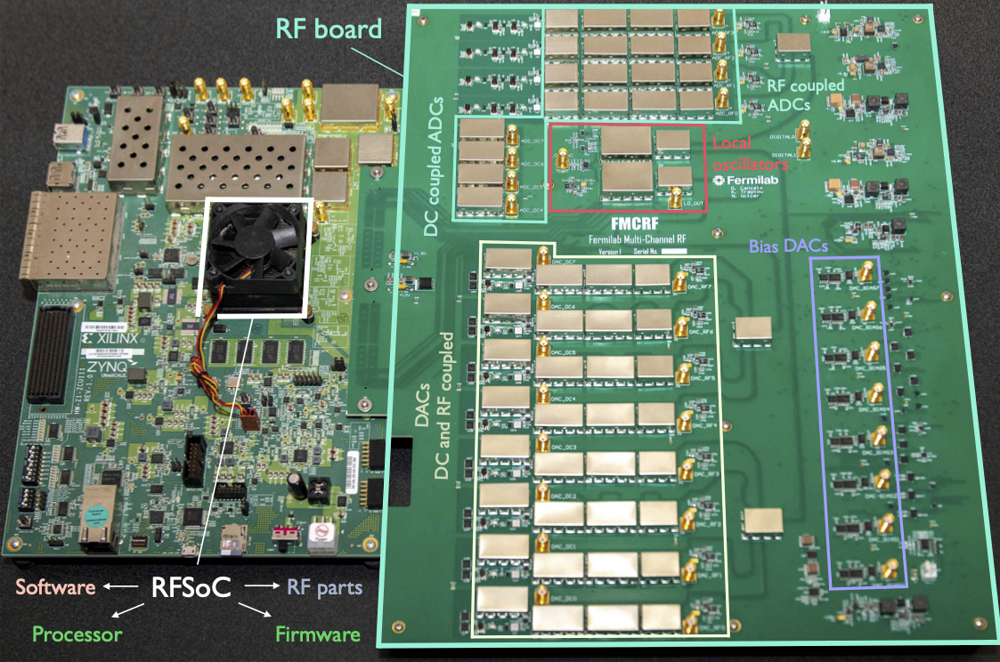
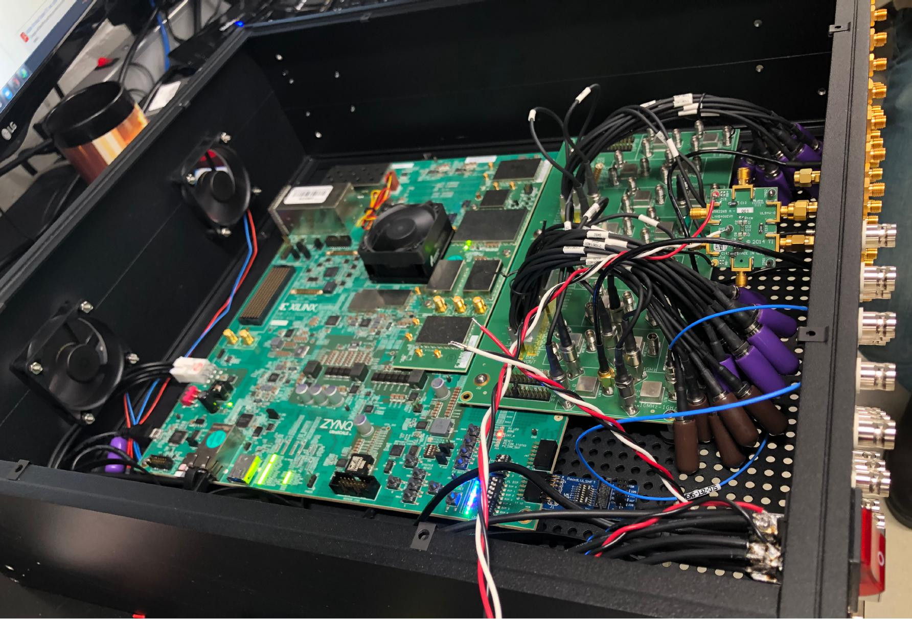

.. Sphinx Apidoc Turorial documentation master file, created by
   sphinx-quickstart on Fri Jan  8 20:52:00 2016.
   You can adapt this file completely to your liking, but it should at least
   contain the root `toctree` directive.

Welcome to the QICK documentation!
=================================================

The Quantum Instrumentation Control Kit (QICK for short) is a Xilinx RFSoC-based qubit controller which supports the direct synthesis of control and readout pulses. The QICK consists of a digital board hosting an RFSoC (RF System-on-Chip) FPGA, custom firmware and software, and an optional companion custom-designed analog front-end board. All of the schematics, firmware, and software are open-source and available on `Github <https://github.com/openquantumhardware/qick>`_. Our team primarily supports the ZCU111, ZCU216, and RFSoC4x2 evaluation boards.  We generally recommend using the newer generation of RFSoCs (ZCU216 and RFSoC4x2) for better overall performance.

Getting started with QICK
#########################

   * First, for a global overview of the QICK and its capabilities, read `our instrumentation paper introducing the QICK <https://arxiv.org/abs/2110.00557>`_.

   * For a list of academic papers produced using the QICK system, check out :doc:`our papers page </papers>`

   * If you have an RFSoC board and you want to configure it as a QICK board, follow `the quick start guide on our Github repository <https://github.com/openquantumhardware/qick/tree/main/quick_start>`_.

   * After you configure your board, you can test it with `our library of loopback demos <https://github.com/openquantumhardware/qick/tree/main/qick_demos>`_. You can also check out `our library of oscilloscope and loopback demos made for our tutorial at IEEE Quantum Week 2023 <https://github.com/openquantumhardware/QCE2023_public>`_.

   * The source code for the QICK software library is available `at this link <https://github.com/openquantumhardware/qick/tree/main/qick_lib>`_. To learn more about the QICK software, see the next section.

   * Chat with us in the #qick channel on the `Unitary Fund Discord <http://discord.unitary.fund/>`_.

QICK software
#############

.. toctree::
   :maxdepth: 2

   cheatsheet
   firmware
   modules
   papers

QICK firmware
#############

   * If you are interested in learning more about the QICK firmware, the firmware and its documentation are available `here <https://github.com/openquantumhardware/qick/tree/main/firmware>`_.

   * You also may want to learn more about how the QICK tProcessor works. In this case, you can reference the `QICK assembly language documentation <https://github.com/openquantumhardware/qick/blob/main/firmware/tProcessor_64_and_Signal_Generator_V4.pdf>`_. Note that this documentation may not be up to date with the current version of the QICK firmware. It is made available here as a learning tool for those interested in learning the principles of the QICK tProcessor. Those who have more specific questions can contact ``lstefana AT fnal.gov``.
