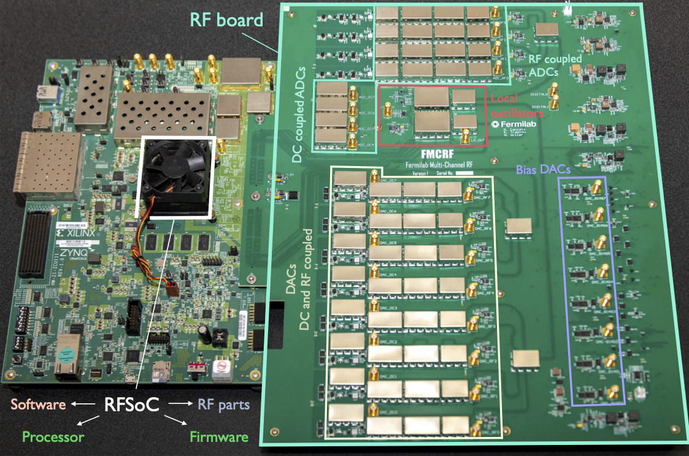
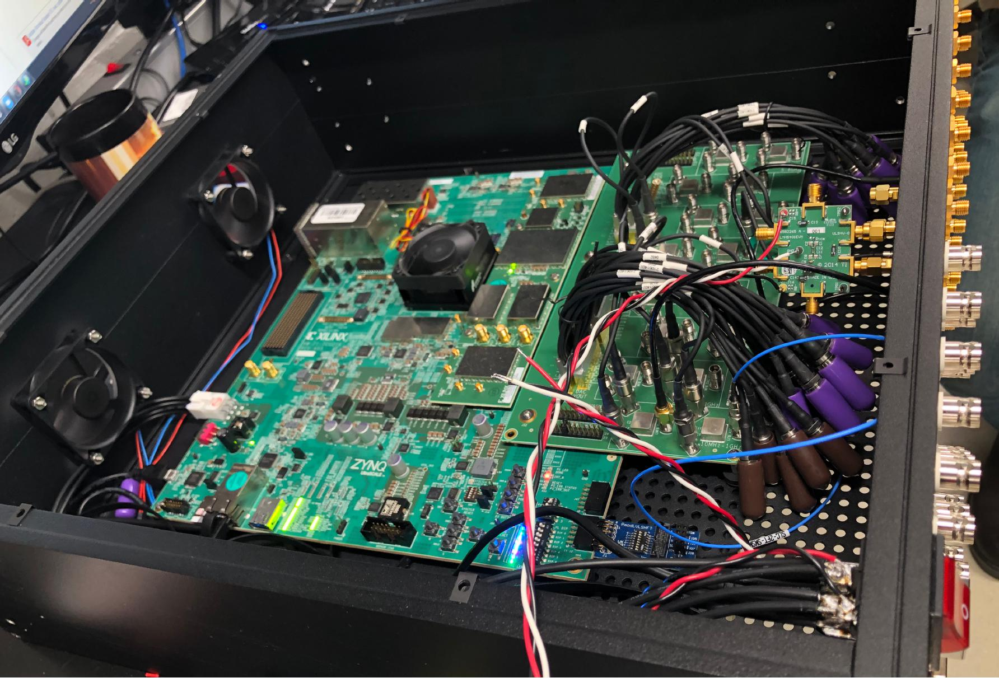

.. Sphinx Apidoc Tutorial documentation master file
   You can adapt this file completely to your liking, but it should at least
   contain the root `toctree` directive.

Welcome to the QICK documentation!
=================================================

What is QICK?
==============

The **Quantum Instrumentation Control Kit (QICK)** is an AMD RFSoC-based qubit controller 
that supports the direct synthesis of control and readout pulses for quantum computing experiments.

QICK consists of:

- **Hardware**: AMD RFSoC board (ZCU111, ZCU216, or RFSoC4x2) with optional custom analog front-end
- **Firmware**: Custom FPGA logic including tProcessor, DDS generators, and readout system
- **Software**: Python library for pulse programming, data acquisition, and real-time feedback

All schematics, firmware, and software are **open-source** and available on GitHub.

Key Features
-------------

- **Real-time control** with tProcessor (multi-core, < 10 ns timing resolution)
- **Direct RF synthesis** up to 6 GHz (ZCU216) without external mixers
- **Multi-tone generation** with phase-coherent muxed generators
- **Real-time feedback** and conditional logic
- **High-speed data streaming** and on-FPGA processing
- **Custom firmware** support via AXI-lite interface

Quick Links
============

- **Source Code**: `GitHub Repository <https://github.com/openquantumhardware/qick>`_
- **Firmware**: `qick/firmware <https://github.com/openquantumhardware/qick/tree/main/firmware>`_
- **QICK Paper**: `arXiv:2110.00557 <https://arxiv.org/abs/2110.00557>`_
- **Community**: :repofile:`Contact & Support <CONTACT.md>`

Extensions & Customization
===========================

- **Pyro4 Server**: Persist board state across notebooks (`Pyro4 demos <https://github.com/openquantumhardware/qick/blob/main/pyro4/00_nameserver.ipynb>`_)
- **QCoDeS Driver**: Save instrument configuration (`QCoDeS-QICK <https://github.com/aalto-qcd/qcodes_qick>`_)
- **QICK-DAWG**: NV centers and quantum defects (`GitHub <https://github.com/sandialabs/qick-dawg>`_)
- **SpinQICK**: Solid-state spin qubits (`GitHub <https://github.com/HRL-Laboratories/spinqick>`_)

📖 Documentation Navigation
============================

The documentation is organized as a **progressive learning path** from beginner to expert.

.. toctree::
   :maxdepth: 2
   :caption:  1. Getting Started

   quick_start

.. toctree::
   :maxdepth: 2
   :caption:  2. Jupyter Notebook Tutorials

   tutorials/00_Getting_Started
   tutorials/01_Basic_Sequencing
   tutorials/02_Parameter_Sweeps
   tutorials/03_Advanced_Timing
   tutorials/04_Real_Time_Feedback
   tutorials/05_Dynamic_Parameters_Subroutines
   tutorials/06_Generators_And_Readouts
   tutorials/07_Advanced_Generators_And_Readouts
   tutorials/08_Hardware_Buffers
   tutorials/09_Appendix_Tips_And_Limits
   tutorials/10_Multi_Board_Synchronization
   tutorials/11_Streaming_And_RealTime_Processing
   tutorials/12_DSP_Blocks_And_Correlators
   tutorials/13_Custom_Firmware_Integration
   tutorials/14_XCOM_Network_Synchronization

.. toctree::
   :maxdepth: 2
   :caption:  3. Hardware & Firmware Reference

   tprocv2_trm
   firmware
   readout
   sg_v6

.. toctree::
   :maxdepth: 2
   :caption:  4. Technical Topics

   topics/index

.. toctree::
   :maxdepth: 2
   :caption:  5. Python API Reference

   modules

.. toctree::
   :maxdepth: 2
   :caption:  6. Community

   contact
   papers

Learning Path Recommendations
==============================

**New to QICK?** Start here:

1. Read the :doc:`quick_start` guide to set up your board
2. Complete the **Basic Tutorials** (00-05) to understand core concepts
3. Work through **Intermediate Tutorials** (06-09) for practical measurements
4. Explore **Advanced Tutorials** (10-13) for specialized applications

**Already familiar with QICK?** Jump directly to:

- :doc:`tprocv2_trm` for tProcessor instruction reference
- :doc:`topics/index` for deep dives on specific topics
- :doc:`modules` for full API documentation

Academic Papers
================

For a list of academic papers published using the QICK system, see :doc:`papers`.
