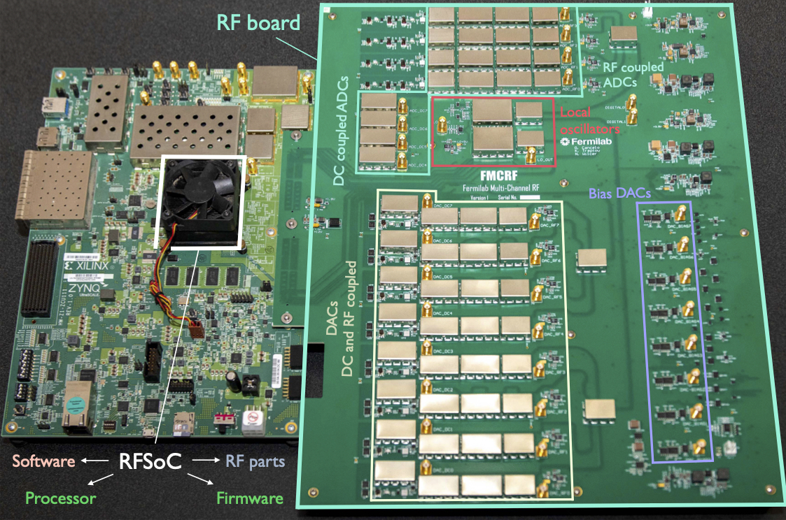
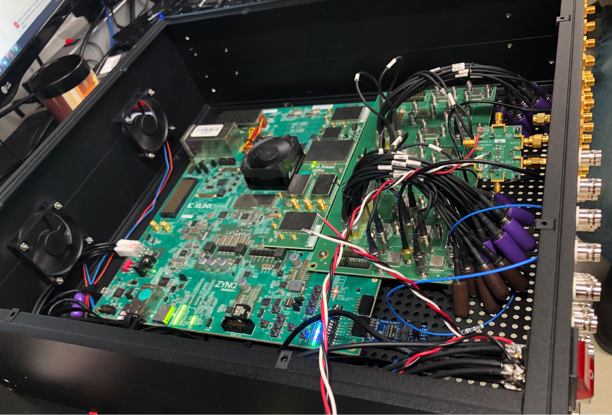

.. Sphinx Apidoc Tutorial documentation master file
   You can adapt this file completely to your liking, but it should at least
   contain the root `toctree` directive.

Welcome to the QICK documentation!
=================================================

What is QICK?
==============

The **Quantum Instrumentation Control Kit (QICK)** is an AMD RFSoC-based qubit controller 
that supports the direct synthesis of control and readout pulses for quantum computing experiments.

QICK consists of:

- **Hardware**: AMD RFSoC board (ZCU111, ZCU216, or RFSoC4x2) with optional custom analog front-end
- **Firmware**: Custom FPGA logic including tProcessor, DDS generators, and readout system
- **Software**: Python library for pulse programming, data acquisition, and real-time feedback

All schematics, firmware, and software are **open-source** and available on GitHub.

Key Features
-------------

- **Real-time control** with tProcessor (multi-core, < 10 ns timing resolution)
- **Direct RF synthesis** up to 6 GHz (ZCU216) without external mixers
- **Multi-tone generation** with phase-coherent muxed generators
- **Real-time feedback** and conditional logic
- **High-speed data streaming** and on-FPGA processing
- **Custom firmware** support via AXI-lite interface

Quick Links
============

- **Source Code**: `GitHub Repository <https://github.com/openquantumhardware/qick>`_
- **Firmware**: `qick/firmware <https://github.com/openquantumhardware/qick/tree/main/firmware>`_
- **QICK Paper**: `arXiv:2110.00557 <https://arxiv.org/abs/2110.00557>`_
- **Community**: :repofile:`Contact & Support <CONTACT.md>`

📖 Documentation Navigation
============================

The documentation is organized as a **progressive learning path** from beginner to expert.

.. toctree::
   :maxdepth: 2
   :hidden:
   :caption:  Getting Started

   quick_start
   tutorials/README

.. toctree::
   :maxdepth: 2
   :hidden:
   :caption:  Technical References

   modules
   topics/index

.. toctree::
   :maxdepth: 2
   :hidden:
   :caption:  For Experts

   firmware/index
   tprocv1
   beta
   alpha

.. toctree::
   :maxdepth: 2
   :hidden:
   :caption:  Community

   contact
   contributions
   papers

.. TODO: too verbose for front page, should move to firmware page (also the prose reeks of LLM)
    The **firmware overview** is the map: which boards QICK supports, which
    cores live on each one, and how the tProcessor, signal generators, and
    readouts fit together on the FPGA -- read this before diving into any
    specific core's page or the assembly-level tProcessor reference.

    The **readout system** turns ADC samples into the I/Q data your program gets
    back. QICK offers several down-converter and buffer cores with different
    tradeoffs (software- vs. tProc-configured, on-chip BRAM vs. DDR4 capture,
    plus a resonator simulator for hardware-in-the-loop testing) -- start at
    :doc:`firmware/readouts/index` for the concepts and the normal ``declare_readout()``/
    ``acquire()`` workflow, then dip into a specific core's page for register-
    level detail.

    The **signal generators** turn your program's pulse definitions into DAC
    output. QICK offers both single-tone arbitrary-envelope generators (for
    shaped pulses) and multiplexed fixed-tone generators (for playing several
    simultaneous tones from one channel) -- start at :doc:`firmware/generators/index` for an
    overview of which core fits which experiment, then see :doc:`firmware/generators/sg_v6` for the
    full worked Python examples shared across the family.

    The **support & utility cores** are smaller IP blocks -- a constant-IQ tone
    source, a tProc-output register/trigger helper, and an AXI-Stream buffering
    core -- that don't fit into either the readout or signal-generator families
    above; see :doc:`firmware/support_cores` for what each one does and how (or whether)
    it's exposed to Python.

    The **tProcessor v2 reference manual** is assembly-level detail --
    instruction encodings, register bit-fields, timing model -- for when you're
    writing or debugging tProc assembly directly, not something you need to read
    top-to-bottom to use QICK day to day.

    **tProc v1** is the previous-generation tProcessor, superseded by v2 on all
    current firmware. Only relevant if you're maintaining pre-v2 code or
    firmware.

**New to QICK?** Start here:

1. Read the :doc:`quick_start` guide to set up your board
2. Complete the :doc:`tutorials/README` to learn core concepts and apply them in measurements
3. Read :doc:`firmware/index` for a big-picture view of the QICK firmware

**Already familiar with QICK?** Jump directly to:

- :doc:`firmware/readouts/index` and :doc:`firmware/generators/index` for the readout/generator firmware
  reference, organized by which core is on your channel
- :doc:`modules` for full API documentation
- :doc:`topics/index` for deep dives on specific topics
- :doc:`tprocv2_trm` for tProcessor instruction reference

Academic Papers
================

For a list of academic papers published using the QICK system, see :doc:`papers`.
