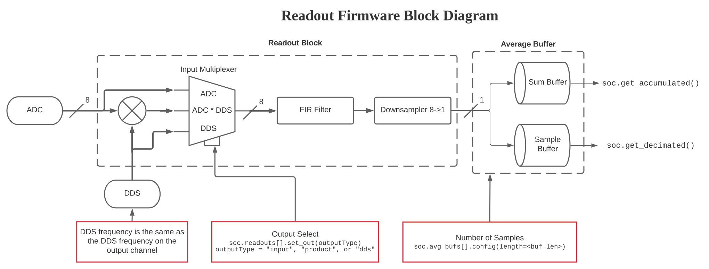

Readout System - QICK Firmware
==============================

.. contents::
  :local:
  :depth: 2

Overview
--------

The QICK readout system is built around two main IP blocks:

* **Readout Block** - Digital down-conversion (DDC), filtering, and decimation
* **Average + Buffer Block** - Data accumulation and storage

The readout process is triggered by a dedicated single-bit ``trig_N_o`` pin
from the tProcessor (one per averaging buffer instance -- see
:ref:`tproc-ports` in :doc:`/firmware` for the full pin model) and can be
configured for raw sample capture or coherent averaging.

Readout Block
-------------

The readout block performs:

1. **Digital Down-Conversion (DDC)** - Mixes the ADC input with a DDS tone
2. **FIR Filtering** - Anti-aliasing filter
3. **Decimation by 8** - Reduces sample rate for easier processing

**Key parameters:**

.. list-table::
  :header-rows: 1
  :widths: 30 70

  * - Parameter
    - Description
  * - DDS frequency
    - Configured via register (not intended for real-time hopping)
  * - FIR taps
    - Fixed coefficients (compiled into firmware)
  * - Decimation factor
    - Fixed at 8
  * - Input selection
    - Can route raw input, DDS wave, or frequency-shifted signal

The user can select which signal is sent to the FIR stage using an output selection register.

Average + Buffer Block
----------------------

This block receives the decimated data stream and can:

* **Store raw samples** - Capture individual samples for analysis
* **Perform coherent averaging** - Accumulate multiple acquisitions

**Capabilities:**

.. list-table::
  :header-rows: 1
  :widths: 30 70

  * - Parameter
    - Value
  * - Raw buffer length
    - Board-dependent, ``2**N_BUF`` samples per component (I/Q) -- see
      :doc:`/avg_buffer`
  * - Accumulated buffer length
    - Board-dependent, ``2**N_AVG`` samples per component (I/Q) -- see
      :doc:`/avg_buffer`
  * - Trigger source
    - One dedicated ``trig_N_o`` pin per buffer instance, *not* a bit
      within a channel-numbered data word -- see :ref:`tproc-ports` in
      :doc:`/firmware`

The buffer IP that stores/accumulates this data (registers, DMA transfer,
edge-counter mode) is documented separately in :doc:`/avg_buffer`.

Python Interface
----------------

Normal QICK programs do **not** poke the readout/buffer drivers directly.
The workflow, inside a :class:`.QickProgram` (e.g. an
:class:`.AveragerProgramV2` subclass), is:

1. Declare each readout channel you'll use, once, with
   :meth:`.QickProgram.declare_readout` -- this sets the downconversion
   frequency/phase/output-select and the readout window length.
2. Fire the ADC capture at the right point in your sequence with
   :meth:`.QickProgramV2.trigger` (or the tProc v1 equivalent).
3. After running the program, pull the data back with
   :meth:`.AcquireMixin.acquire` (accumulated) or
   :meth:`.AcquireMixin.acquire_decimated` (raw waveform) -- see
   :doc:`topics/readout_modes` for which one to use.

.. code-block:: python

  from qick import *

  soc = QickSoc()

  class LoopbackProgram(AveragerProgramV2):
      def _initialize(self, cfg):
          # readout channel 0: 100 MHz downconversion, 3 us window
          self.declare_readout(ch=0, length=3.0, freq=100.0, gen_ch=0)
          self.declare_gen(ch=0, nqz=1)
          self.add_pulse(ch=0, name="probe", style="const",
                          freq=100.0, phase=0, gain=0.5, length=3.0)

      def _body(self, cfg):
          self.trigger(ros=[0], t=0)      # arm readout channel 0
          self.pulse(ch=0, name="probe", t=0)
          self.delay_auto(t=1.0)          # wait for pulse+readout to finish before looping

  prog = LoopbackProgram(soccfg, reps=1000, final_delay=10.0, cfg={})

  # Accumulated: one (I, Q) point per rep, averaged
  iq_avg = prog.acquire(soc)

  # Decimated: the raw readout waveform (for debugging the window/pulse)
  prog2 = LoopbackProgram(soccfg, reps=1, final_delay=10.0, cfg={})
  iq_dec = prog2.acquire_decimated(soc)

**Low-level driver access:**

The readout and buffer are still reachable directly, as ``soc.readouts[i]``
and ``soc.avg_bufs[i]``, for debugging or hand-rolled acquisition outside
the ``acquire()``/``acquire_decimated()`` flow -- see :doc:`/avg_buffer`'s
Python Interface section for the buffer-level ``config_avg``/
``transfer_avg``/``config_buf``/``transfer_buf`` calls this normally sits on
top of. :meth:`.AbsReadout.set_all`/``set_all_int`` on the readout driver
itself are explicitly for debugging only -- the recommended way to configure
a readout's frequency/phase/output-select is ``declare_readout()``.

Hardware Considerations
-----------------------

**Clock frequencies:**

- ADC sampling rate: ``soc.fs_adc`` (typically 3072 MHz)
- After decimation by 8: effective rate = ``soc.fs_adc / 8``

**Buffer sizes:**

- Raw mode: up to ``soc.cfg['readouts'][i]['buf_maxlen']`` I/Q pairs (1024 on
  the reference board, i.e. 2k total samples)
- Average mode: up to ``soc.cfg['readouts'][i]['avg_maxlen']`` I/Q pairs
  (16384 on the reference board, i.e. 32k total) -- read these from your own
  board's config rather than assuming a number, see :doc:`/avg_buffer`.

**Example: Calculating acquisition time**

.. code-block:: python

  n_samples = 1024
  decimation = 8
  adc_rate = soc.fs_adc           # Hz
  sample_period = 1 / (adc_rate / decimation)  # seconds per decimated sample
  acquisition_time = n_samples * sample_period
  print(f"Acquisition takes {acquisition_time * 1e6:.2f} us")

Related Documentation
---------------------

* :doc:`/avg_buffer` - the averaged/raw buffer IP downstream of this readout
* :doc:`/readout_pfb` - the polyphase-filter-bank multi-channel readout
  variant (``axis_pfb_readout_v2``/``v3``/``v4``), which channelizes into
  several simultaneous demod outputs instead of one tunable frequency
* :doc:`topics/readout_modes` - ``acquire()`` vs. ``acquire_decimated()``
* :doc:`/tprocv2_trm` - tProcessor v2 for triggering and sequencing
* :doc:`/firmware` - Firmware overview and channel assignments
* :doc:`topics/timing` - Timing considerations for readout
* :doc:`topics/freq_matching` - Frequency matching between generators and readouts
