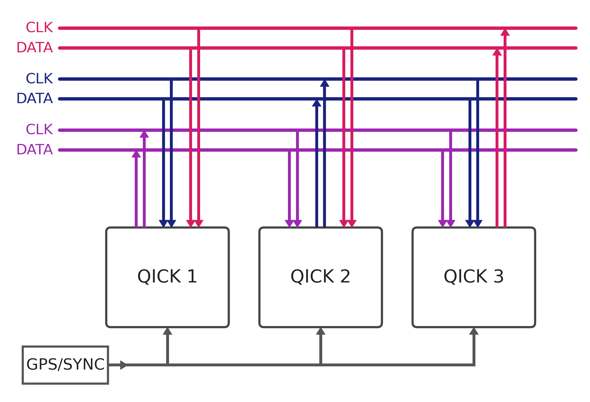
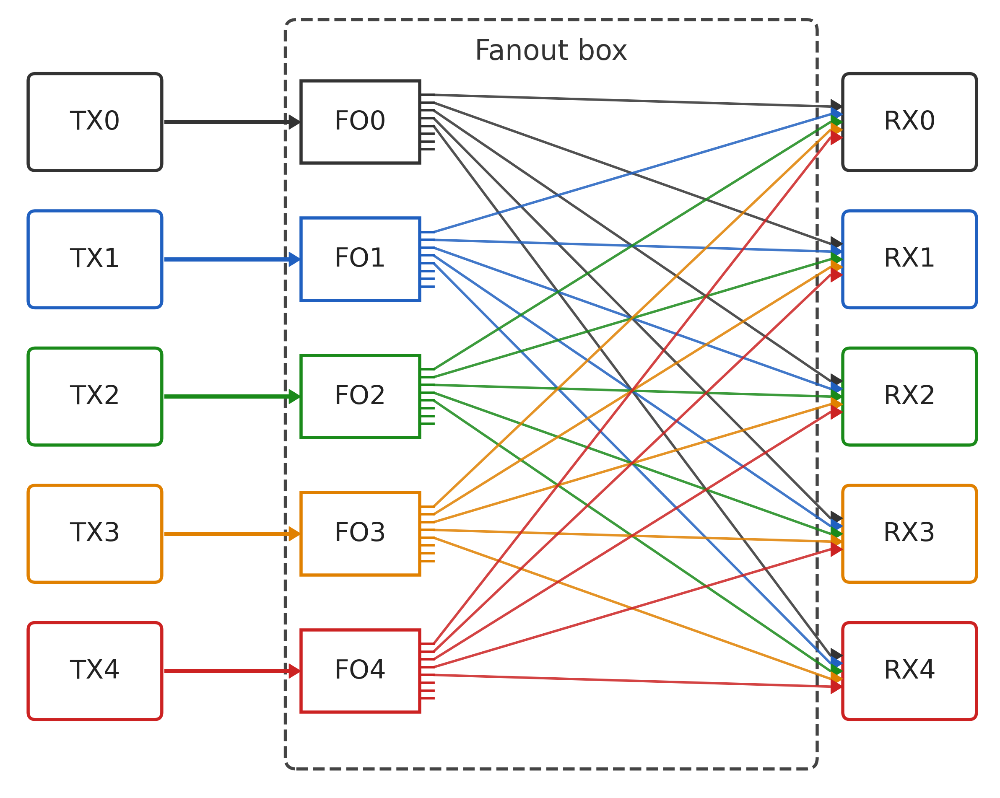
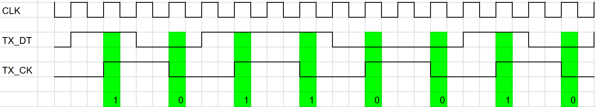
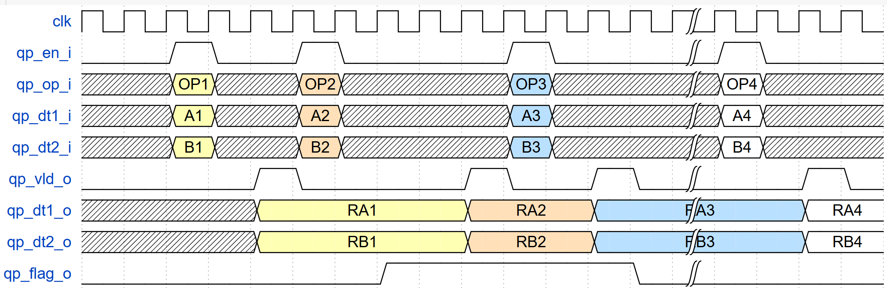
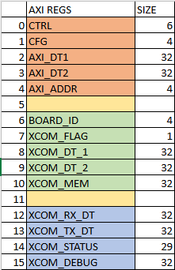
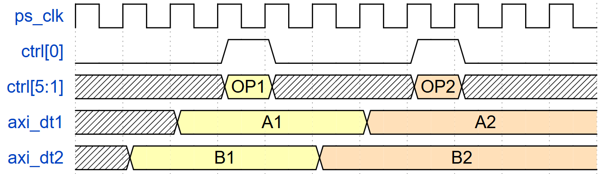

.. _xcom:

XCOM: Multi-Board Network Synchronization and Communication
============================================================

XCOM (X - Communication) is a **full mesh network** that enables precise synchronization and low-latency communication between multiple QICK boards. This module is essential for scaling quantum control systems beyond a single RFSoC board.

For a detailed description of the XCOM architecture and performance, refer to the XCOM paper: `arXiv:2603.18977v1 <https://arxiv.org/abs/2603.18977>`_.

Overview
--------

XCOM provides two primary capabilities:

1. **Synchronization**: Aligns multiple QICK boards with <100 ps skew, free of drift and loss of lock
2. **Communication**: Provides deterministic, all-to-all simultaneous data exchange with latency below 185 ns (can be reduced to 62 ns)

The XCOM network supports up to **15 boards** (prototype supports 5) and is designed to scale to large quantum computing systems.

XCOM can be operated from:

- **Python scripts** (via AXI-lite interface, higher latency due to Linux overhead)
- **tProc programs** (real-time operation at fabric clock speed, lowest latency)

   XCOM block architecture (source: XCOM paper)

Hardware Requirements
---------------------

XCOM requires additional hardware components:

1. **FMC Transceiver Board**: A small board that plugs into the FMC connector of each ZCU216 board. It routes LVDS signals to RJ45 connectors.

2. **External Hub**: A fanout hub that copies each transmitter's signal to all receivers, enabling full mesh connectivity.

The current hardware prototype supports up to 5 boards, while the firmware IP already supports up to 15 boards and can be extended further.

   XCOM hardware configuration (source: XCOM paper)

Clock Domains
-------------

The XCOM block operates across three clock domains:

.. list-table::
   :header-rows: 1
   :widths: 15 25 60

   * - Domain
     - Source
     - Description
   * - ``t_clk``
     - tProc timing clock
     - Fastest clock; used for high-speed serial communication
   * - ``c_clk``
     - tProc core clock
     - Used for command processing and state machines
   * - ``ps_clk``
     - Processing System clock
     - Used for AXI-lite interface to Python

It is assumed that ``t_clk`` ≥ ``c_clk`` ≥ ``ps_clk`` in all configurations.

Communication Protocol
----------------------

XCOM uses two LVDS signals for point-to-point communication, following a **Data Strobe Encoding** scheme:

- **``xclk``** (strobe): Each change indicates a new value is present on the data line
- **``xdata``** (serial data): Carries the serialized command and data

   Data strobe encoding example for 8-bit data transmission

The ``XCOM_CFG_AXI`` register defines the period of the strobe signal in ``t_clk`` cycles. Permitted values range from 0 to 7:

.. list-table::
   :header-rows: 1
   :widths: 15 35

   * - Value
     - Strobe period (t_clk cycles)
   * - 0
     - 2
   * - 1
     - 4
   * - 2
     - 8
   * - 3
     - 16
   * - 4
     - 32
   * - 5
     - 64
   * - 6
     - 128
   * - 7
     - 256

Interface Signals
-----------------

The XCOM peripheral connects to the QICK processor via a dedicated interface with the following signals:

.. list-table::
   :header-rows: 1
   :widths: 25 15 60

   * - Signal
     - Direction
     - Description
   * - ``qp_en``
     - Input
     - Enable; activates peripheral on rising edge
   * - ``qp_op[4:0]``
     - Input
     - 5-bit operation code
   * - ``qp_dt_o[31:0]``
     - Input
     - 32-bit data from processor to peripheral
   * - ``qp_rdy``
     - Output
     - Indicates peripheral ready status
   * - ``qp_vld``
     - Output
     - Marks valid data from peripheral
   * - ``qp_dt_i[31:0]``
     - Output
     - Data from peripheral to processor
   * - ``qp_flag``
     - Output
     - Flag for inter-board signaling

   Peripheral interface timing diagram

Python Interface
----------------

The ``QICK_Xcom`` class provides Python access to the XCOM hardware through AXI-lite registers.

AXI Registers
~~~~~~~~~~~~~

   XCOM AXI register map

The following registers are available:

.. list-table::
   :header-rows: 1
   :widths: 20 15 10 55

   * - Register
     - Address
     - Access
     - Description
   * - ``xcom_ctrl``
     - 0
     - R/W
     - Command control register
   * - ``xcom_cfg``
     - 1
     - R/W
     - Configuration register
   * - ``axi_dt1``
     - 2
     - R/W
     - Data register 1
   * - ``axi_dt2``
     - 3
     - R/W
     - Data register 2
   * - ``axi_addr``
     - 4
     - R/W
     - Address register
   * - ``board_id``
     - 6
     - R
     - Local board ID
   * - ``flag``
     - 7
     - R
     - Local flag status
   * - ``dt1``
     - 8
     - R
     - Received data 1
   * - ``dt2``
     - 9
     - R
     - Received data 2
   * - ``mem``
     - 10
     - R
     - Memory readback
   * - ``rx_dt``
     - 12
     - R
     - RX data (debug)
   * - ``tx_dt``
     - 13
     - R
     - TX data (debug)
   * - ``status``
     - 14
     - R
     - Status register
   * - ``debug``
     - 15
     - R
     - Debug register

Register Control
~~~~~~~~~~~~~~~~

The ``XCOM_CTRL`` register is used to send commands. The ``EN`` field (``ctrl[0]``) auto-resets after one clock cycle, ensuring commands are executed only once.

   ``XCOM_CTRL`` register timing diagram

When ``EN`` is high:

- ``OP_I`` (``ctrl[5:1]``) contains the command to execute
- ``AXI_DT1`` and ``AXI_DT2`` contain data for the command

Commands
--------

XCOM supports two types of commands:

- **NET commands**: Sent over the network to other boards (OP code MSB = 0)
- **LOC commands**: Executed locally, affecting only this board (OP code MSB = 1)

NET Commands
~~~~~~~~~~~~

.. list-table::
   :header-rows: 1
   :widths: 30 10 15 45

   * - Command
     - Code
     - OP
     - Function
   * - ``XCOM_CLEAR_FLAG``
     - 0
     - 00000
     - Clear flag on remote board
   * - ``XCOM_SET_FLAG``
     - 1
     - 00001
     - Set flag on remote board
   * - ``XCOM_SEND_8BIT_1``
     - 2
     - 00010
     - Send 8-bit data to qp_dt1
   * - ``XCOM_SEND_8BIT_2``
     - 3
     - 00011
     - Send 8-bit data to memory
   * - ``XCOM_SEND_16BIT_1``
     - 4
     - 00100
     - Send 16-bit data to qp_dt1
   * - ``XCOM_SEND_16BIT_2``
     - 5
     - 00101
     - Send 16-bit data to memory
   * - ``XCOM_SEND_32BIT_1``
     - 6
     - 00110
     - Send 32-bit data to qp_dt1
   * - ``XCOM_SEND_32BIT_2``
     - 7
     - 00111
     - Send 32-bit data to memory
   * - ``XCOM_QRST_SYNC``
     - 8
     - 01000
     - Synchronize with external PPS
   * - ``XCOM_AUTO_ID``
     - 9
     - 01001
     - Auto-assign board ID
   * - ``XCOM_UPDATE_DT8/16/32``
     - 10, 12, 14
     - 01010, 01100, 01110
     - Future use
   * - ``XCOM_QCTRL``
     - 11
     - 01011
     - Control tProc state

LOC Commands
~~~~~~~~~~~~

.. list-table::
   :header-rows: 1
   :widths: 30 10 15 45

   * - Command
     - Code
     - OP
     - Function
   * - ``XCOM_SET_ID``
     - 16
     - 10000
     - Set local board ID
   * - ``XCOM_WRITE_FLAG``
     - 17
     - 10001
     - Write local flag
   * - ``XCOM_WRITE_REG``
     - 18
     - 10010
     - Write to qp_dt register
   * - ``XCOM_WRITE_MEM``
     - 19
     - 10011
     - Write to internal memory
   * - ``XCOM_RST``
     - 31
     - 11111
     - Reset XCOM block

For a complete reference, see :doc:`XCOM-commands`.

tProc Control via XCOM
----------------------

The ``XCOM_QCTRL`` command enables remote control of tProc state. The ``DT2[2:0]`` field selects the operation:

.. list-table::
   :header-rows: 1
   :widths: 25 75

   * - DT2[2:0]
     - Operation
   * - 2 or 10
     - Time reset
   * - 3 or 11
     - Time update
   * - 4 or 12
     - Core start
   * - 5 or 13
     - Core stop
   * - 6 or 14
     - Processor start
   * - 7 or 15
     - Processor stop

Synchronization Protocol
------------------------

XCOM synchronization follows a multi-step process:

1. **Frequency synchronization**: All boards share a common external reference clock (e.g., 100 MHz rubidium)
2. **Phase synchronization**: PLLs configured in nested zero-delay mode
3. **DAC/ADC alignment**: Multi-tile sync (MTS) calibration
4. **Absolute time alignment**: Master broadcasts RESET and START commands via ``XCOM_QRST_SYNC``

The synchronization sequence:

1. Designate one board as master
2. Run ``AUTO_ID`` to assign network IDs
3. Master broadcasts ``XCOM_QRST_SYNC`` to reset absolute clocks
4. Master broadcasts ``XCOM_QCTRL`` to start all tProcs simultaneously

This achieves <100 ps skew between boards, enabling truly synchronized multi-board experiments.

Performance
-----------

.. list-table::
   :header-rows: 1
   :widths: 50 50

   * - Metric
     - Value
   * - Inter-board skew
     - <100 ps
   * - Latency (32-bit word)
     - 186 ns @ 100 MHz
   * - Latency (32-bit word, projected)
     - 62 ns @ 312.9 MHz
   * - Maximum boards
     - 15 (firmware), 5 (current prototype)
   * - Clock frequency
     - Up to 312.9 MHz (LVDS HP I/O)

Debugging
---------

The XCOM block provides extensive debug capabilities through dedicated registers.

Status Register
~~~~~~~~~~~~~~~

The ``status`` register provides real-time status information:

.. list-table::
   :header-rows: 1
   :widths: 20 15 65

   * - Field
     - Bits
     - Description
   * - ``tx_st``
     - [1:0]
     - Transmitter state (0=IDLE, 1=WVLD, 2=WSYNC, 3=WRDY)
   * - ``rx_st``
     - [6:7]
     - Receiver state (0=IDLE, 1=HEADER, 2=DATA, 3=REQ, 4=ACK)
   * - ``tx_ready``
     - 15
     - Transmitter ready
   * - ``board_id``
     - [11:15]
     - Local board ID
   * - ``rx_data_cntr``
     - [7:11]
     - Received data counter

Debug Register
~~~~~~~~~~~~~~

The ``debug`` register exposes internal state machine signals for advanced debugging.

Python Debug Methods
~~~~~~~~~~~~~~~~~~~~

.. code-block:: python

   # Print all AXI registers
   soc.xcom_0.print_axi_regs()

   # Print status information
   soc.xcom_0.print_status()

   # Print debug information
   soc.xcom_0.print_debug()

See Also
--------

* :doc:`XCOM-commands` — Complete command reference

* :doc:`../tutorials/14_XCOM_Network_Synchronization` — XCOM demonstration notebook

* `XCOM paper (arXiv:2603.18977v1) <https://arxiv.org/abs/2603.18977v1>`_

* `QICK GitHub repository <https://github.com/openquantumhardware/qick/tree/main/firmware/ip/xcom>`_
