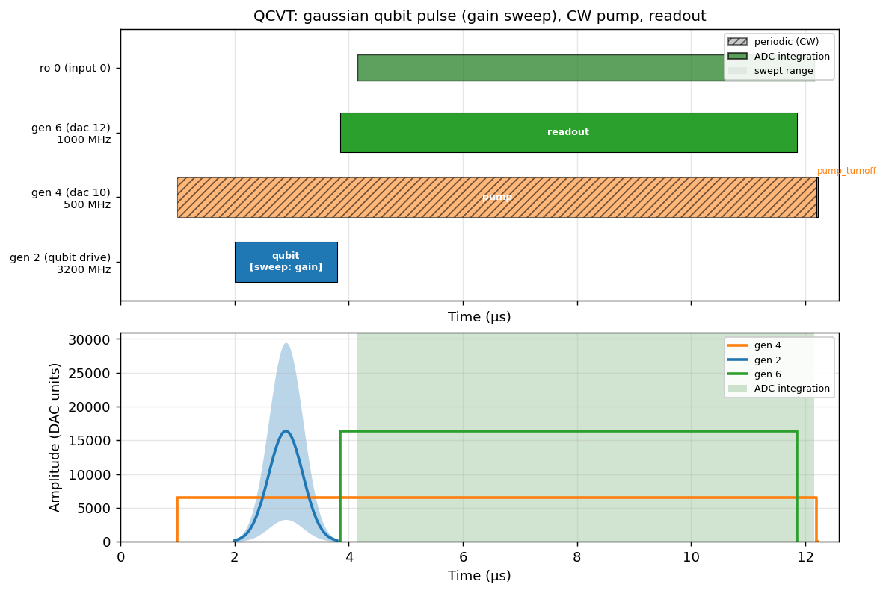

# QCVT — QICK Control Visualization Tool

Visualize and export the pulse schedule of a QICK `asm_v2` program **before it is
sent to an RFSoC**. Works online (connected) and fully offline (from a saved
config or a compiled-program pickle).

Originally developed at https://github.com/DRNag2/QCVT and proposed for inclusion
in QICK in https://github.com/openquantumhardware/qick/issues/229.



## Install

```bash
# from the QICK repo root
pip install -e ".[qcvt]"
# optional: load compiled-program pickles
pip install -e ".[qcvt-pickle]"
```

## Quick start (offline demo)

```bash
python qick_demos/qcvt/run_offline_example.py
python qick_demos/qcvt/walkthrough_demo.py
```

No RFSoC needed — these use the bundled `qick_config.json`.

## In your experiment code

```python
from qcvt import show_schedule, review_schedule, extract_schedule

prog = YourProgram(soccfg, reps=1, final_delay=0, cfg=config)
show_schedule(prog, title="My experiment")

# Pre-submit gate
ok = review_schedule(prog, save_dir="qcvt_reviews/my_exp", show=True, confirm=True)
if not ok:
    raise RuntimeError("aborted")

sched = extract_schedule(prog, strict=True)
```

## Tests

```bash
pip install -e ".[qcvt]" pytest
pytest qick_lib/qcvt/tests/ -v
```
