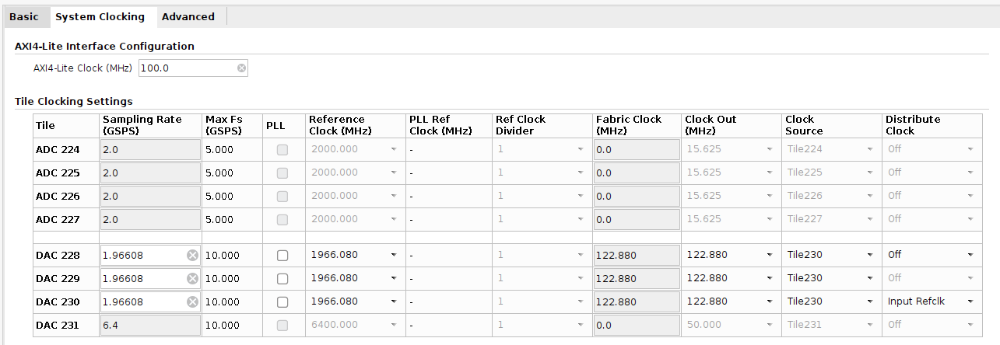
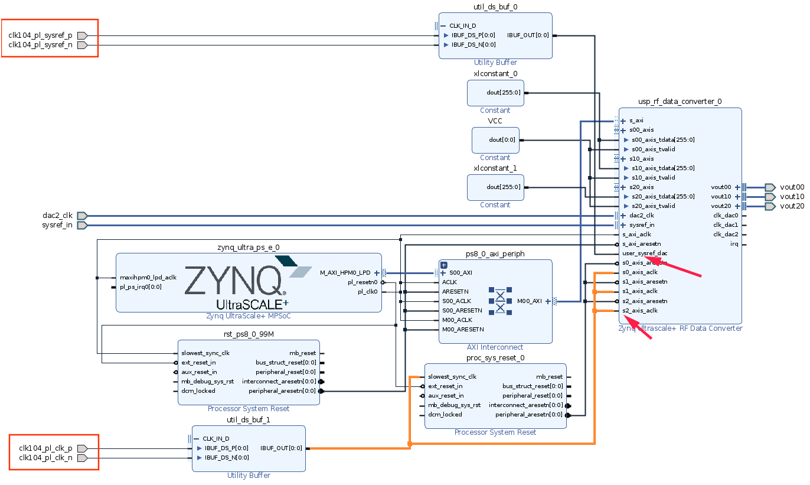

# IPQ PYNQ Utilities

This is a project which aims to improve the life of those using PYNQ. More specifically those using PYNQ with the ZCU208, which comes with some challenges: Currently the main responsibility of this project is to configure the PLLs on the CLK104 board, which would otherwise require the use of the "BoardUI" utilities or other manual means. The Xilinx SDK does provide some helpers to load preconfigured clock files, but this is not a very flexible solution. `ipq_pynq_utils` provides the following services:

* Read out RFDC IP synthesis configuration to determine which clock frequencies are expected and if MTS is required
* If MTS is enabled: Determine a suitable SYSREF frequency, enable SYSREF outputs
* Configure LMK04828B to output the expected `ADC/DAC_REFCLK`, `PL_CLK` and potentially SYSREF signals
* Generate and configure solutions for the ADC and DAC LMX2594 PLLs to produce the expected sample clocks
* Program bitstream to the device
* If MTS was enabled: Perform multi-tile synchronization

## Installation Instructions

```
$ sudo pip3 install git+https://github.com/kit-ipq/ipq-pynq-utils.git
```

## Usage Guide

This project will mostly be useful if you're trying to use the RF DataConverters on an RFSoC device with a CLK104 board to provide the clock signals. Currently only the ZCU208 has been tested. As such, the project assumes that you have instantiated a dataconverter IP block in your block design.

The central idea of the module is to read out the settings of the IP block and to determine which frequencies are expected to be applied at which clock pins, and consequently to generate a clocking solution for the three PLLs that will yield the expected results. When required a SYSREF signal is also generated and MTS performed at a later stage.

Note that this requires you to accurately specify the expected sample frequencies in the IP configurator. 

For a simple configuration with some DACs at 4915.2 MHz see the following:



Note that to facilitate MTS, the external PL clock should be used to interface with the ip block:



The following will be required as part of your constraints file to connect the pins:

```
set_property -dict {PACKAGE_PIN B9    IOSTANDARD LVDS_25 } [get_ports clk104_pl_sysref_n]
set_property -dict {PACKAGE_PIN B10   IOSTANDARD LVDS_25 } [get_ports clk104_pl_sysref_p]
set_property -dict {PACKAGE_PIN B7    IOSTANDARD LVDS_25 } [get_ports clk104_pl_clk_n]
set_property -dict {PACKAGE_PIN B8    IOSTANDARD LVDS_25 } [get_ports clk104_pl_clk_p]
```

### Choice of sample frequency

While the system is quite flexible in theory, if you want things to just work, choose sample frequencies which are multiples of 245.76 MHz.

### Software usage guide

```
# [... Other imports ...]

# RF Dataconverter APIs, must be loaded before Overlay is created (!)
import xrfdc
import ipq_pynq_utils

# Now we can create a board object which will be used to interact with and configure the clocks

board = ipq_pynq_utils.ZCU208Board()
board.print_clock_summary()

"""
Name            |  Frequency  | Enabled | Sysref Enabled
----------------|-------------|---------|----------------
PLL2_FREQ       | 2457.60 MHz | True    |
AMS_SYSREF      |    7.68 MHz |         | True
SYSREF_FREQ     |    7.68 MHz |         | True
ADC_REFCLK      |  245.76 MHz | False   | False  
DAC_REFCLK      |  245.76 MHz | False   | False  
RF_PLL_ADC_REF  |  245.76 MHz | True    | True   
RF_PLL_DAC_REF  |  245.76 MHz | True    | True   
PL_CLK          |  307.20 MHz | True    | True   
"""

# print_clock_summary() now produces a summary of how the clocks are configured in their
# default configuration. This is most likely not the configuration that will ultimately
# be used, but provides you with an idea of available options which can be configured
# through the board object.

# To continue, the overlay has to be created as usual, with one difference being that
# the download option is set to False, as to prevent premature programming of the
# FPGA bitstream:
ol = Overlay("system.bit", ignore_version=True, download=False)

# This overlay object contains information about how the different IP blocks in the
# block-diagram were configured, and is used as a reference for how the different clocks
# should be configured:

board.configure(
    ol,
    download=True
)

"""
Parsing RFDC configuration ... 

 Name | Enable | Ref Clock | Clock Source | PLL Enable | Fabric CLK |  MTS  | Clock Dist
------|--------|-----------|--------------|------------|------------|-------|------------
 DAC2 | True   |   4915.20 | DAC2         | False      |     307.20 | False | False

Clock requirements:
 * RF_CLKO_ADC: Not used
 * RF_CLKO_DAC: 4915.2 MHz
 * ADC_REFCLK:  Not used
 * DAC_REFCLK:  Not used
 * PL_CLK:      307.2 MHz
 * MTS:         Disabled

Generating DAC PLL configuration:
  i |   f_vco  | DIV | MIN_N | DLY_SEL |   n  |   R  | R_pre |  f_pfd  |   f_out  | Delta f |   Metric   
----|----------|-----|-------|---------|------|------|-------|---------|----------|---------|------------
  0 |  9830.40 |   2 |    28 |       1 |   40 |    1 |     1 |  245.76 |  4915.20 |    0.00 | 8.0000e+01

Choosing solution 0 with minimal metric 80.

Configured clocks, loading bitstream ... done!
"""

# This invocation will output a table of ADCs and DACs with information about which of
# these are in use, which input frequency they expect, whether the PLLs are enabled
# and which fabric clock frequency is required. Finally the output contains the
# derived clocking requirements for the CLK104 board. These are determined by
# input requirements of the corresponding ADC and DAC tiles, with the determination
# of the PL clock frequency being a special case:
# Because of the different interface
# width of the ADC and DAC tiles, it may happen that two different interface clock
# frequencies are required for ADCs and DACs, at which point the expected PL clock
# cannot be determined automatically anymore and depends on how the clocks are
# generated. In this case the process will halt, unless an additional
# pl_clk frequency parameter is provided (Unit: MHz):

board.configure(
    ol,
    download=True,
    pl_clk=307.2
)

"""
Parsing RFDC configuration ... 

 Name | Enable | Ref Clock | Clock Source | PLL Enable | Fabric CLK |  MTS  | Clock Dist
------|--------|-----------|--------------|------------|------------|-------|------------
 ADC1 | True   |   4915.20 | ADC1         | False      |     409.60 | False | False
 DAC2 | True   |   4915.20 | DAC2         | False      |     307.20 | False | False

WARNING: Fabric clock missmatch between RF tiles. This is not generally a problem, but this means that a device-internal PLL will be necessary to generate the required clocks and a PL_CLK rate must be specified manually!
Clock requirements:
 * RF_CLKO_ADC: 4915.2 MHz
 * RF_CLKO_DAC: 4915.2 MHz
 * ADC_REFCLK:  Not used
 * DAC_REFCLK:  Not used
 * PL_CLK:      307.2 MHz
 * MTS:         Disabled

Generating ADC PLL configuration:
  i |   f_vco  | DIV | MIN_N | DLY_SEL |   n  |   R  | R_pre |  f_pfd  |   f_out  | Delta f |   Metric   
----|----------|-----|-------|---------|------|------|-------|---------|----------|---------|------------
  0 |  9830.40 |   2 |    28 |       1 |   40 |    1 |     1 |  245.76 |  4915.20 |    0.00 | 8.0000e+01

Choosing solution 0 with minimal metric 80.

Generating DAC PLL configuration:
  i |   f_vco  | DIV | MIN_N | DLY_SEL |   n  |   R  | R_pre |  f_pfd  |   f_out  | Delta f |   Metric   
----|----------|-----|-------|---------|------|------|-------|---------|----------|---------|------------
  0 |  9830.40 |   2 |    28 |       1 |   40 |    1 |     1 |  245.76 |  4915.20 |    0.00 | 8.0000e+01

Choosing solution 0 with minimal metric 80.

Configured clocks, loading bitstream ... done!
"""

# The final Clock Requirements as they will be applied to the CLK104 are listed in
# the last line of the output. Whether MTS is required is determined based on whether
# MTS was enabled in the IP integrator at IP configuration time. If yes, the MTS
# procedure will be executed automatically after device programming.
```
