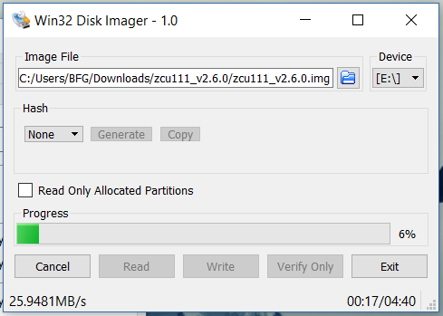
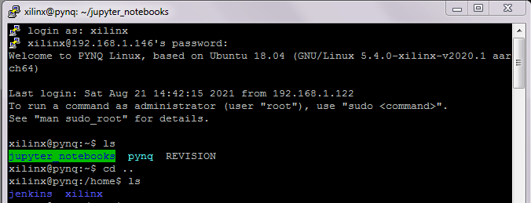
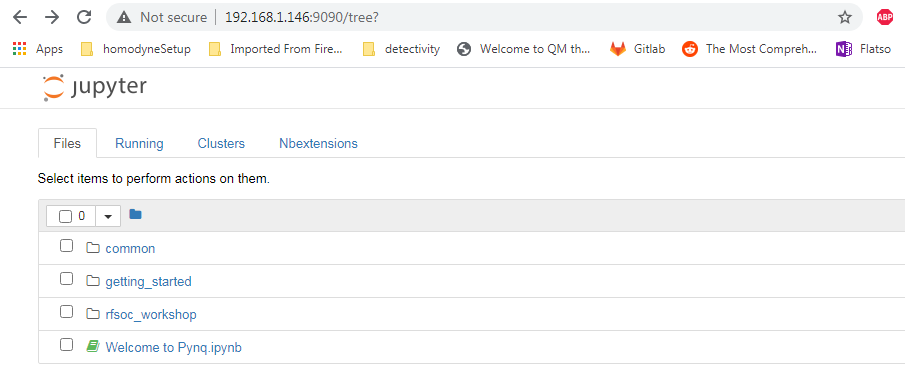
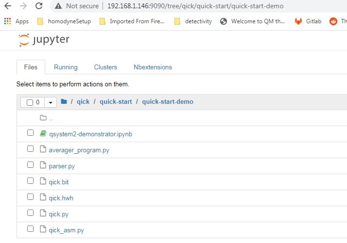
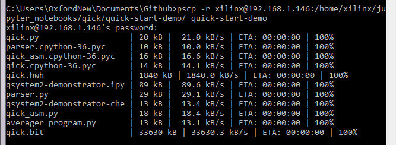

# QICK quick-start guide 

This guide will show you how to setup QICK after configuring your computer and RFSOC ZCU111 board on a local area network (LAN). By the end of this guide you will have run a QICK program in loopback mode (where signals loop back from an RF DAC directly into an RF ADC)! 

### Prerequisites
* A ZCU111 RFSOC evaluation board kit (available for purchase at www.avnet.com) which has been connected to either the XM500 breakout board which comes with the ZCU111 evaluation board kit or the QICK RF-board custom-designed at Fermilab. The kit includes:
  * A ZCU111 evaluation board
  * A XM500 breakout board
  * An SMA cable that you will use to connect the system in loopback mode
  * A power cable (12 volt, 50 watt) for the ZCU111
  * A micro SD card (16 GB) that you will flash the PYNQ 2.6.0 disk image onto
* A personal computer with an Ethernet port (this guide assumes a Windows PC with no command line interface so as to be accessible to users with little command line programming experience; contact sarafs@princeton.edu if you would like this guide to include support for other operating systems). 
  * The computer should have git installed. In this guide, Github Desktop is used. 
    * You can download Github Desktop here: https://desktop.github.com/
  * The computer should have either SSH or PuTTY/PSCP installed. PuTTY is an open-source SSH client for the Windows operating system. This guide uses PuTTY/PSCP for accessibility, as some users are not familiar with the command line. 
    * You can download PuTTY here: https://www.chiark.greenend.org.uk/~sgtatham/putty/latest.html (for instance `<putty-64bit-0.76-installer.msi>`). You can also download PSCP from the same link (for instance `<pscp.exe>`). 
* A router (this guide used a standard Cisco RV160 VPN Router which is available for purchase at www.amazon.com). The router used in this guide has 4 LAN ports. For instance, in a typical qubit system setup you can connect one LAN port to your personal computer, a second LAN port to your ZCU111, and a third point to an Ethernet switch (for example the NETGEAR 24-Port Gigabit Ethernet Unmanaged Switch (JGS524) which is available for purchase at www.amazon.com). That Ethernet switch can place 24 more devices (such as external trigger sources, local oscillators, programmable attenuators or other lab equipment) on the router's subnet, making them accessible to your personal computer. 
* Two Ethernet cables that you will use to attach 1) your ZCU111 board and 2) your personal computer to the router.

### Flashing the PYNQ 2.6.0 image onto your micro SD card
* Your ZCU111 RFSOC evaluation board kit comes with a micro SD card that is preloaded with a PYNQ image. The QICK hardware requires PYNQ 2.6.0, so let's update the micro SD card with this version of the PYNQ image. 
* 

### Putting together your ZCU111 board
* 
* Connect a RF DAC channel (e.g.  to an RF ADC channel to be used in the QICK loopback test. To replicate the demo

### Finding your RFSOC on the router's network
* Power on your 
* Connect your personal computer via Ethernet to a LAN port of the router
* Connect your ZCU111 evaluation board via Ethernet to another LAN 

### Connecting to your RFSOC via Jupyter and via SSH

### Moving the QICK tools onto your RFSOC's processor

### Running a QICK program in loopback mode

### Moving data off of your RFSOC's processor onto your personal computer

