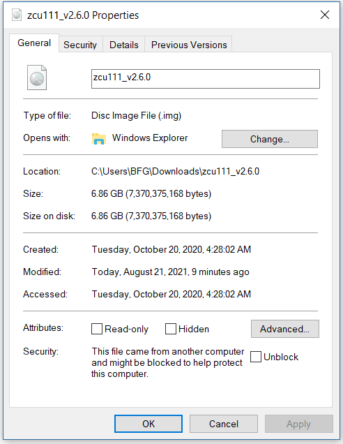
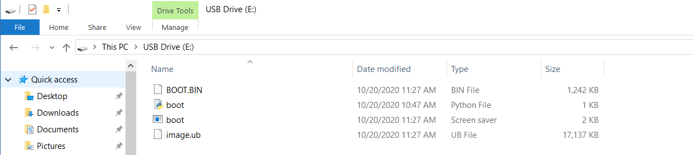
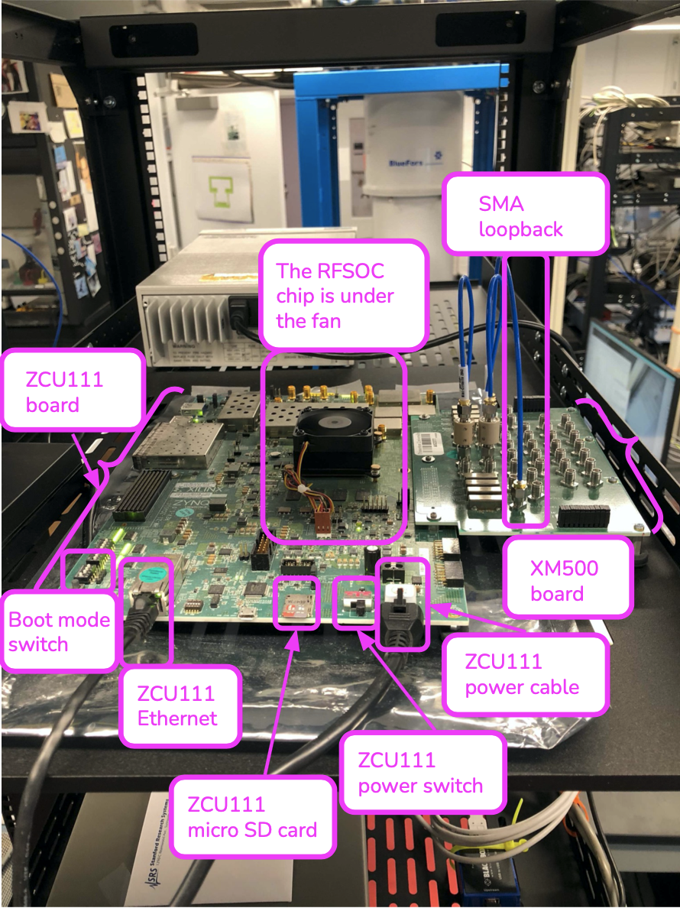
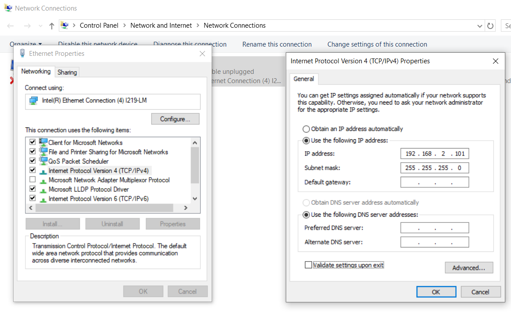
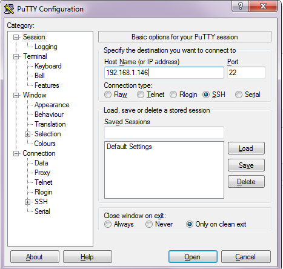
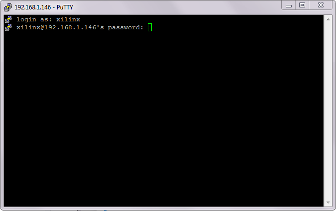
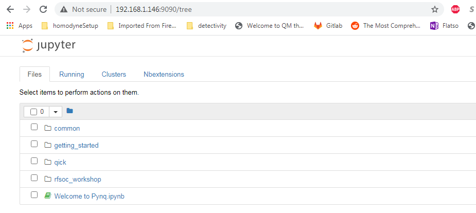

# QICK quick-start guide 

***Have questions? Contact us through any of the channels listed on [the main README](../README.md).***

This guide will show you how to set up QICK after configuring your computer and RFSoC board on a local area network (LAN). By the end of this guide you will have run a QICK program in loopback mode (where signals loop back from an RF-DAC directly into an RF-ADC)!

Up to the QICK-specific steps, the setup instructions below run parallel to the PYNQ and RFSoC documentation, and you might want to refer to that as well:
* https://www.rfsoc-pynq.io/getting_started.html
* https://www.rfsoc-pynq.io/rfsoc_4x2_getting_started.html
* https://xilinx-wiki.atlassian.net/wiki/spaces/A/pages/57606309/ZCU111+RFSoC+RF+Data+Converter+Evaluation+Tool+Getting+Started+Guide

## Get a board
The ZCU216, RFSoC4x2, and ZCU111 are all supported by QICK and have identical FPGA logic capabilities; the differences are in the RF DACs+ADCs and the design of the rest of the board.
For new purchases we generally recommend the current generation of RFSoC boards for the best high-frequency performance: the ZCU216 or RFSoC4x2. The ZCU216 has a higher channel count, allows for flexibility in AC- or DC-coupling your signals, and can be used with custom frontend boards; the RFSoC4x2 is available with academic pricing. But we highly recommend that you look at the board specifications yourself.

The Xilinx-produced ZCU216 and ZCU111 boards are available from most major electronics distributors - check the "Authorized Distributors" list on the board's Xilinx page:
* https://www.xilinx.com/products/boards-and-kits/zcu111.html
* https://www.xilinx.com/products/boards-and-kits/zcu216.html

The RealDigital-produced RFSoC4x2 board is available directly from RealDigital: https://www.realdigital.org/hardware/rfsoc-4x2. We recommend that when communicating with RealDigital or AMD/Xilinx, that you mention that you plan to use the board with QICK - this helps them understand your needs.

## Prerequisites
* Your RFSoC evaluation board kit, from which you will need the following:
  * The RFSoC board itself, and any daughterboards:
    * For the ZCU216, you'll need the CLK-104 clocking board and the XM655 frontend board.
    * For the ZCU111, you'll need the XM500 frontend board.
  * RF cables:
    * An SMA cable that you will use to connect the system in loopback mode.
    * For the ZCU216, you'll also need the two HC2-to-SMA patch cables to connect the RF-DAC and RF-ADCs to baluns.
  * Power brick
  * The micro-SD card (16 GB or larger) that you will flash the PYNQ OS image onto; an adapter for full-size SD is also included
  * Tools:
    * A 5/16" wrench for SMA connectors (a torque wrench is nice if you have one, but the wrench in the kit is fine for these first tests).
    * For ZCU216/ZCU111, a Phillips-head screwdriver (size #1) and 4 mm hex wrench to attach the daughterboard(s).
    * For ZCU216, an 0.050" hex wrench for the HC2 connectors.
  * Ethernet cable
  * Micro-USB cable (for debugging, or changing the network configuration)
* A personal computer, which should have:
  * An Ethernet port that you can free up temporarily
    * If you don't have a free port, you can buy a USB-Ethernet adapter - any reputable brand (TP-Link, StarTech) should be OK.
  * An SD or micro-SD card reader (such as IOGEAR SuperSpeed USB 3.0 SD/Micro SD Card Reader/Writer (GFR304SD) which is available for purchase at www.amazon.com). A reader that directly reads micro-SD cards is recommended, to avoid confusion with adapters.
  * This guide assumes a Windows PC with the following tools so as to be accessible to users with little command-line programming experience, but you can use whatever tools you're comfortable with. Linux and MacOS are also fine: you will be able to use their native SSH/SCP clients, but you will need to find your own utilities for writing SD card images.
    * The computer should have git installed. In this guide, Github Desktop is used.
      * You can download Github Desktop here: https://desktop.github.com/
    * The computer should have either SSH or PuTTY/PSCP installed. PuTTY is an open-source SSH client for the Windows operating system. This guide uses PuTTY/PSCP for accessibility, as some users are not familiar with the command line.
      * You can download PuTTY here: https://www.chiark.greenend.org.uk/~sgtatham/putty/latest.html (for instance `putty-64bit-0.76-installer.msi`). This installer will also install the `pscp` command.
    * The computer should have a utility for writing disk images to SD cards. We recommend the Win32DiskImager utility, which is an open-source tool for writing image files to disks. You will use this utility to flash the PYNQ OS image onto your micro-SD card.
      * You can download the Win32DiskImager utility here: https://sourceforge.net/projects/win32diskimager/
<!--
* A router (this guide used a standard Cisco RV160 VPN Router which is available for purchase at www.amazon.com). The router used in this guide has 4 LAN ports. For instance, in a typical qubit control setup you can connect one LAN port to your personal computer, a second LAN port to your ZCU111, and a third point to an Ethernet switch (for example the NETGEAR 24-Port Gigabit Ethernet Unmanaged Switch (JGS524) which is available for purchase at www.amazon.com). That Ethernet switch can place 24 more devices (such as external trigger sources, local oscillators, programmable attenuators or other lab equipment) on the router's subnet, making them accessible to your personal computer. 
* Two Ethernet cables that you will use to attach 1) your ZCU111 board and 2) your personal computer to the router.
-->

## Flash the PYNQ operating system image onto your micro SD card
* Your RFSoC board kit comes with a micro SD card. QICK requires an up-to-date PYNQ image (v2.6 through v3.0.1), so let's update the micro SD card with this version of the PYNQ image. The PYNQ documentation for this step is also good: https://pynq.readthedocs.io/en/latest/appendix/sdcard.html
* First, download the PYNQ image:
  * For ZCU111 and RFSoC4x2, v3.0.1 is the current recommended version: http://www.pynq.io/boards.html
  * For ZCU216, download the v2.7.0 version from the link in https://github.com/sarafs1926/ZCU216-PYNQ/issues/1.
* If you downloaded it as a .zip, you need to unzip it to get a .img file. You will see that it's quite a large file.

<p align="center">
 
</p>

* Plug your micro SD card into your computer. If you look in the Windows File Explorer you will see a new disk drive pop up, for example in my case it was the `E:\` drive. This is the drive associated with your micro SD card. 
* Now, open the Win32DiskImager utility and configure 1) the image file to be your PYNQ image file and 2) the device to be the `E:\` drive, as in the below picture. Before clicking `Write`, double check that you are not flashing the image file to the wrong drive (e.g. your personal computer hard drive)!

<p align="center">
 
</p>

* Click `Write`.  
* After the write completes, now look in the Windows File Explorer to see what is now contained in the `E:\` drive. You can see several files that are used to boot the RFSoC. The contents of the `E:\` drive are lightweight and there is plenty more space on the disk (about 6.8 GB!). So we are now ready to load this micro SD card into the RFSoC board.

<p align="center">
 
</p>


## Assemble and power on your RFSoC board

* For the ZCU216 and ZCU111, assemble the board with daughterboard(s). The 4 mm hex wrench is used to tighten the jackscrew nuts under the frontend board screws, then the screwdriver is used to screw down the board. For both the frontend board and the ZCU216's CLK-104 board, be careful to align the high-density connector before screwing down the board. You may find these resources useful in addition to the kit documentation:
  * For the ZCU216 board, the basic assembly section of this webpage: https://xilinx-wiki.atlassian.net/wiki/spaces/A/pages/246153525/RF+DC+Evaluation+Tool+for+ZCU216+board+-+Quick+start. 
  * For the ZCU111 board, this video guide: https://www.youtube.com/watch?v=4JfKlv8kWhs
* Slide your micro SD card into its slot on the board.
* Make sure the board is in SD card boot mode.
  * For the RFSoC4x2, this is a simple slider switch with "SD" and "JTAG" labels.
  * For the ZCU216 and ZCU111, there's a 4-position DIP switch (SW2 on the ZCU216, SW6 on the ZCU111) which you must set as shown in the photo below (of a ZCU111, but the switch is the same on the ZCU216), with the first position set to "ON" and the rest to "OFF." Xilinx documentation: [ZCU216](https://docs.amd.com/r/en-US/ug1390-zcu216-eval-bd/Zynq-UltraScale-RFSoC-XCZU49DR-Configuration), [ZCU111](https://docs.amd.com/r/en-US/ug1271-zcu111-eval-bd/RFSoC-Device-Configuration).

<p align="center">
 
</p>

* Use your wrench to wire an SMA cable between an RF-DAC channel and an RF-ADC channel.
  * For the ZCU216, choose DAC 2_231 and ADC 0_226, which will be generator 6 and readout 0. This is a two-step process, because the XM655 directly exposes the differential ports of the RF-DACs and RF-ADCs, and you must patch these through to the baluns that convert them to regular (single-ended) signals:
    * First identify the gold HC2 connector you want; e.g. 2_231 is labeled next to connector JHC3. Connect an HC2-SMA cable and screw it down.
    * Now identify the P/N pair of SMA pigtails you want; e.g. the pair for 2_231 are the last two on this cable. Connect these to the P and N ports of an available low-frequency (10 MHz-1 GHz) balun. The third SMA connector next to this balun is the single-ended port; your SMA cable will connect the single-ended ports of the two baluns.
    * See also https://docs.amd.com/r/en-US/ug1390-zcu216-eval-bd/CoreHC2-Connector-Pinout-XM655-Only
  * For the RFSoC4x2, choose DAC_B and ADC_D, which will be generator 0 and readout 0. (You will need to change the generator number in the demo notebook later, since the demos assume generator 6.)
  * For the ZCU111, choose DAC 229 CH3 and ADC 224 CH0, which will be generator 6 and readout 0. These names are written directly on the XM500 breakout board. See also https://docs.amd.com/r/en-US/ug1271-zcu111-eval-bd/XM500-ADC/DAC-Data-and-Clock-SMA
  * You're doing this with the board powered down, but in general: it's OK to connect/disconnect RF cables with the board powered. However, you should be very careful not to touch any of the exposed electrical components with metal tools or connectors. ***This can cause immediate, permanent damage to your board which cannot be repaired.*** In particular:
   * The frontend daughterboards of the ZCU216 and ZCU111 have rows of header pins, some of which can destroy the board if shorted to each other or to ground.
   * If you have SMA cables with loose ends (for example, the unused lines of a ZCU216's HC2-to-SMA cable), always cover their connectors completely with the rubber caps that came with the cables.
   * Observe general housekeeping and workplace hygiene principles - don't leave loose tools rolling around your lab bench, keep loose adapters in bowls or drawers, be aware of where a tool might fall if dropped.
* Connect an Ethernet cable and/or USB cable, and configure your computer, as specified in the next section.
* Connect the power cable to the RFSoC board. Flip the board power switch on (it's next to the power cable). You should hear the fan above the RFSoC chip begin to whir, and you should see LED lights blinking all over the board. You should also see lit or blinking LEDs that indicate the Ethernet port is connected to your computer: two LEDs built into the face of the port and a third LED next to the port labeled "LINK."
* Your board setup should look something like the below cartoon:

<p align="center">
 
</p>

* The board will take a minute or two to boot up. Five minutes is more than enough; if you can't connect to the RFSoC after this time something is wrong with your setup (check your cabling, check that your SD card is properly inserted, retry with a serial connection over USB as described below).

## Connect to your RFSoC over the network

You will normally connect to the RFSoC over a network connection, most typical setups are one of the following:
* Point-to-point: the RFSoC is directly connected to the PC through a single Ethernet cable. This is the simplest but usually not a long-term solution, because it consumes an Ethernet port on the PC. (The RFSoC4x2 also supports creating a point-to-point network connection over USB; refer to the 4x2 documentation.)
* LAN with static IPs: the RFSoC, PC, and other lab equipment are connected to a switch, which doesn't assign IP addresses. Each piece of equipment has a unique static IP configured internally; all IPs are in a common range.
* LAN with router: the RFSoC, PC, and other lab equipment are connected to a router, which assigns IP addresses automatically. Other lab equipment might be connected to the router as well. The router could additionally be configured as an Internet gateway, to allow the PC and RFSoC to access the Internet.
 * Your institution's network is probably capable of playing this role, but this is not recommended because problems are difficult to debug, and because this exposes the RFSoC to all other users on the network. Only do this if you have experience with Linux network configuration and security, know the network security rules for your institution, and follow all of the security recommendations below.

### Configure the network
The default network settings of the RFSoC are as follows (see the section below for instructions on changing them):
* If it's connected to a router, it will use an assigned address.
* Otherwise it will use 192.168.2.99.

It is sometimes difficult to tell what IP address the RFSoC is using. Here are some ways:
* If you're using a router, the router will know what address it assigned to the RFSoC (see the section below).
* You can use the serial-over-USB connection to log in and check the network status (see the section below)
* The RFSoC4x2 has an OLED screen that displays the IP address.

#### For a LAN with static IP
The default settings are fine for point-to-point or router setups, but for a static-IP LAN you will generally want an IP other than 192.168.2.99, because your other equipment is unlikely to be using the 192.168.2.xxx IP range.
In that case you should make an initial connection to change the RFSoC's network settings, using one of the other options (point-to-point network, router network, or serial-over-USB). We recommend the point-to-point network, which is usually the easiest to set up.

* Once you have a terminal with root privileges, open `/etc/network/interfaces.d/eth0` in a text editor such as `vim` or `nano`.
 * If you're not familiar with any command-line text editor, `nano` is a good choice:
  * Run `nano /etc/network/interfaces.d/eth0` to open the file.
  * Make your change. You can cut entire lines with Control+k and paste them with Control+u. A hash at the start of a line in an `interfaces` file comments it, which you might use to stash old settings or describe your changes.
  * Save with Control+o (hit Enter to write to the same file you opened)
  * Exit with Control+x.
* The file will look like this:

```
auto eth0
iface eth0 inet dhcp

auto eth0:1
iface eth0:1 inet static
address 192.168.2.99
netmask 255.255.255.0
```

* Change the `192.168.2.99` to the desired static IP address, and save the file. You can now close the terminal, power off the RFSoC board, and connect it to the switch.
* Configure youe computer's Ethernet port to connect to the LAN with a static IP.

#### For a point-to-point Ethernet connection
* Connect your Ethernet cable from your computer to the RFSoC Ethernet port.
* Configure your computer's Ethernet port with a static IP in the 192.168.2.xxx range, similar to below (see also https://pynq.readthedocs.io/en/latest/appendix/assign_a_static_ip.html):

<p align="center">
 
</p>

* After powering up, the board should be online at `192.168.2.99`. You can now connect to it at this address using Jupyter or SSH (see below).

#### For a LAN with a router
Use a router (e.g. a Cisco RV160 VPN Router which is available for purchase at www.amazon.com), which will automatically assign an IP address to your RFSoC board. The router used in this guide has 4 LAN ports. For instance, in a typical qubit control setup you can connect one LAN port to your personal computer, a second LAN port to your ZCU216, and a third point to an Ethernet switch (for example the NETGEAR 24-Port Gigabit Ethernet Unmanaged Switch (JGS524) which is available for purchase at www.amazon.com). That Ethernet switch can place 24 more devices (such as external trigger sources, local oscillators, programmable attenuators or other lab equipment) on the router's subnet, making them accessible to your personal computer.

* Connect both your computer and the RFSoC to the router with Ethernet cables.
* Unlike the point-to-point case, you won't set a static IP on your computer's Ethernet port; you'll leave it on its default configuration, where it will let the router auto-configure its address.
* Log into your router via a web browser. In the case of the router used in this guide, doing so is straightforward and is explained here: https://www.cisco.com/c/dam/en/us/td/docs/routers/csbr/RV160/Quick_Start_Guide/EN/RV160_qsg_en.pdf
* After powering up, look at the list of devices found by your router. You should see two devices; your PC and your RFSoC (id `pynq`). Take note of the IP address that was assigned to the RFSoC (in my case it was assigned the address `192.168.1.146`). You can now connect to the board at this address using Jupyter or SSH (see below).

<p align="center">
 
</p>

* Most routers will allow you to assign a permanent IP address to the RFSoC based on its MAC address, which you can get by running the `ifconfig` command in a terminal and looking for `ether`. The ZCU216 and ZCU111 have a sticker with the MAC address, and you should check that this matches the output of `ifconfig` (if not, see https://github.com/openquantumhardware/qick/issues/182).

### Log in
You can connect to the RFSoC over the network in two ways: through the RFSoC's Jupyter server, which you access using a web browser and Jupyter password, and through the RFSoC's SSH server, which you access using SSH and SCP clients and Linux password. Jupyter will probably be your main interface, and you will use it to run the QICK demos. SSH gives you a terminal and SCP is used for file transfers; you can also create terminals and upload/download files in Jupyter, but it's not as flexible. You will use SCP to upload the QICK software and firmware to the RFSoC.

The Jupyter server and the Linux operating system have separate access credentials, with the following defaults:
* Jupyter: password is `xilinx`.
* Linux OS: username is `xilinx`, password is `xilinx`. There is also a root (admin) account, password `xilinx`, but the `xilinx` user can become root using `sudo -s` (you will need to enter the user password).

***These defaults are very insecure.*** You must change them if your RFSoC will be connected to a network accessible to people outside your lab group. Some of the default settings have alternatives that add no inconvenience, and we recommend that everyone should change those even if the network is safe. See the section below on "Secure your RFSoC" for details.

#### Over the network, via Jupyter

* Now you are prepared to connect to your RFSoC. Before you clone the `qick` repository and copy it onto the RFSoC, let's see what is initially on the RFSoC's operating system (this was determined by the contents of the PYNQ image). To do so, simply enter the IP address assigned to the RFSoC into a web browser on your personal computer: `192.168.1.146`. The username and password for the ZCU111 are by default `xilinx` and `xilinx`, respectively. You can change those by entering `sudo` mode once you've logged into the RFSoC via SSH (you will log in via SSH in the next part of this guide).  
* You should see this default Jupyter notebook browser: 

<p align="center">
 
</p>

* You can see that there are a few demo Jupyter notebooks already loaded onto the RFSoC which you can feel free to explore. But now let's connect to the RFSoC via SSH, where you will have more flexibility and control. For instance, only after you have established an SSH connection can you copy the `qick` repo onto the RFSoC and do the upcoming QICK loopback demo.
* If you need to open a root terminal for changing network settings, click the "New" button at the upper right and open a terminal.

#### Over the network, via SSH

* To connect via SSH, open the PuTTY application and input the IP address assigned to the RFSoC (`192.168.1.146`) as below:
<p align="center">
 
</p>

* Click `Open`. You will see the following login screen on a new terminal. Use the Linux username and password (by default, `xilinx` and `xilinx`).

<p align="center">
 
</p>

* After successfully logging in you will see a Linux terminal. You have now remotely logged on to the RFSoC.

<p align="center">
 
</p>

* If you need root privileges for changing settings, run `sudo -s` and enter the user password again.
* It's convenient to save these session settings; you can also set the username as part of the hostname e.g. `xilinx@192.168.1.146`.

#### Through a serial connection over USB, for debugging or changing the configuration
You can also log in to the RFSoC using a serial connection.
* Connect a PC to the board via the micro-USB port. Under the Device Manager under COM ports the RFSoC should show up as three COM connections. Usually, the port you should use is the first of those three.
* Power up the RFSoC board. It is important to boot the board after the USB cable has been connected between the board and your PC.
* Using PuTTY, select "Serial" connection type, enter the port number (e.g. `COM4`), and the serial speed, `115200`.
* This will open a terminal that directly connects to the RFSoC CPU. You may need to log in with Linux credentials.

These are things you might check:
* For debugging network issues, `ifconfig` will give the assigned IP address.
* If the RFSoC is having trouble accessing network devices outside the LAN, the default gateway may not be set; this can be checked with `ip route`. There should be an IP address marked as `default`. If this is not present, a default must be set using `sudo ip route add default via xxx.xxx.xxx.1`, replacing the IP address with the local network address.
* Finally, the RFSoC may need to be configured to properly access the internet. Open `/etc/resolv.conf` in a text editor such as `vim` or `nano`, and ensure that it contains `nameserver 8.8.8.8`, `options eth0`. Note that `resolv.conf` may be re-generated when the board is power-cycled.

### Secure your RFSoC
As mentioned above, the default settings for accessing the RFSoC are quite insecure. If you change nothing, anybody with access to the RFSoC's network will be able to get full access without much difficulty. The significance of this depends on your network configuration and the harm that could be caused by a breach. In other words:
* How much do you trust the people and devices on the RFSoC's network? If you have a point-to-point connection, the RFSoC is only connected to your PC, so the network is as secure as your PC. If you put the RFSoC on your institution's network, you can trust the network only as much as you trust every user and device on the network - if an attacker compromises any computer at your institution, they could then attack your RFSoC.
* What harm could an attacker do? If the security of your RFSoC is compromised, they could read, delete, or modify anything on the SD card, run arbitrary malware on the RFSoC, or control any equipment controlled by the RFSoC. So you should judge the consequences of this.
* Are there any rules you need to follow? Your institution may have rules about securing computers that are connected to the institution's network, connected to expensive equipment, or used for important/sensitive research. These rules may apply, and may be stricter than what you would arrive at by taking a "common sense" approach to the two points above.

You should weigh these factors and the recommendations below.

#### Disable root login
Brute-force password-guessing attacks against SSH servers are extremely common, and the root account is a common target because the username is standard and the account has maximum privileges. The default root password of `xilinx` is easily guessed.
You could set a stronger root password, or block SSH login for the root account, but given that `sudo` is just as easy a way to get root privileges, you never actually need to use the root password and it's easier to disable it completely.
In other words, this improves security and adds no inconvenience; **everyone should make this change.**

* Log in via SSH using the `xilinx` username and that account's password (`xilinx`, unless you've changed it).
* Run `su` and enter the root password (`xilinx`) to become root.
* Run `passwd -l root` to lock the root password. This makes it impossible to log in as root over SSH or using `su`, but you can still get root access through Jupyter or `sudo`.
* Run `exit` (or use the keyboard shortcut Control-d) to exit your root session and get back to being a regular user.
* Run `su` and enter the `xilinx` password again. This should fail!
* Run `sudo -s` and enter the user password to check that you can still use `sudo` to become root.

The terminal output from these steps should look like this:
```
xilinx@pynq:~$ su
Password: 
root@pynq:/home/xilinx# passwd -l root
passwd: password expiry information changed.
root@pynq:/home/xilinx# exit
exit
xilinx@pynq:~$ su
Password: 
su: Authentication failure
xilinx@pynq:~$ sudo -s
[sudo] password for xilinx: 
root@pynq:/home/xilinx#
```

#### Change the Linux user password
The default username and password are both `xilinx`, and this is easily guessed if an attacker knows the board is running PYNQ OS.
Because this account has `sudo` rights, knowing this account's password is as good as having root access.
Changing the password doesn't add significant inconvenience.
**We strongly recommend that you change this password.**

Choose the strength and style (random characters, random words, etc.) of the password based on what is natural to you and your lab group, how secure you need your RFSoC to be, and how dangerous the network environment is.
You should store the password in a secure and resilient way; again this will depend on how your lab group operates, but could mean a lab notebook or a file on a secure shared disk.

* Choose a new password and make a record of it. 
* Log in via SSH using the `xilinx` username and that account's password (`xilinx`).
* Run `passwd`; enter the current password (`xilinx` again) and then enter your desired password twice.
* Disconnect and check that you can log in via SSH using the new password.

The terminal output from these steps should look like this:
```
xilinx@pynq:~$ passwd
Changing password for xilinx.
Current password: 
New password: 
Retype new password: 
passwd: password updated successfully
xilinx@pynq:~$ 
```

#### Restrict remote Jupyter access
Because the Jupyter server runs with root privileges, having access to Jupyter is as good as having root access.
The default password `xilinx` is easily guessed; also, because the Jupyter server uses HTTP and not HTTPS, an attacker listening to traffic on your network could get a hash of your password when you log in (not as bad as getting the password, but this is still considered a risk).
The preferred solution is to block remote access to Jupyter, and only access Jupyter through SSH.
This adds a step when connecting to Jupyter, but is easy to set up (easier than changing the Jupyter password, and more effective for security).
**We strongly recommend this if your RFSoC is on an untrusted network.**

To set this up, get a terminal with root privileges and open `/root/.jupyter/jupyter_notebook_config.py` in a text editor (such as `nano` - see the section above on setting up a static IP). Page down to the bottom, where you should see something like this:
```
# c.TerminalManager.cull_interval = 300
c.NotebookApp.ip = '0.0.0.0'
c.NotebookApp.notebook_dir = '/home/xilinx/jupyter_notebooks'
c.NotebookApp.password = 'sha1:46c5ef4fa52f:ee46dad5008c6270a52f6272828a51b16336b492'
```

Put a hash at the beginning of the line with `c.NotebookApp.ip`, to comment out that setting. Now reboot. Point your browser to the RFSoC's IP address (for example 192.168.1.146): it should redirect to port 9090 (i.e. the address bar should show `192.168.1.146:9090`) as usual, but the page should not load.

To access Jupyter after making this change, you will need to use SSH port forwarding:
* Add port forwarding to your SSH configuration. The example below shows how you would tell PuTTY to forward port 5678 on your PC to port 9090 on the RFSoC (the Jupyter server's port). The choice of 5678 is arbitrary, and if you connect to multiple RFSoCs from the same computer in this way you need to use different ports. (If using macOS or Linux, you would specify port forwarding as part of the command, e.g. `ssh xilinx@192.168.1.146 -L 5678:localhost:9090`.)
<p align="center">
 
</p>

* Make the SSH connection. You will need to leave the connection open while using the Jupyter server.
* Point your browser to `localhost:5678`. You should get the Jupyter server.
* You might need to open port 5678 in your firewall: one way to do this is to enable the checkbox "Local ports accept connections from other hosts" in the PuTTY configuration shown above and make the connection, which should trigger Windows to ask if you want to open the port. Once you've done this, you should disable that checkbox (since you're otherwise exposing the Jupyter server to the network again, just through your PC instead of directly from the RFSoC).

## Copy the QICK tools onto your RFSoC

* Use Github Desktop to clone the `qick` repo onto your personal computer (Google around for resources if you are not sure how to do this). 
<!--
* Now, copy the `pscp.exe` into the same directory as your cloned `qick` repo, as below: 

<p align="center">
 
</p>
-->
* Open the Command Prompt application in Windows and, after navigating to the directory containing your cloned `qick` repo, type in the following command (substituting the IP address that was assigned to your RFSoC):

<p align="center">
 
</p>

* This copied the `qick` repository into the `jupyter_notebooks` folder in the `/home/xilinx/` directory of the RFSoC. 
* Your Jupyter notebook browser has now updated to include the `qick` repository, as shown below: 

<p align="center">
 
</p>

## Install the `qick` Python package and running a QICK program in loopback mode

<!--
* Navigate to the `qick` directory and run: `sudo python3 -m pip install .`
This will install the qick Python package.
-->
* Navigate to the `qick_demos` subfolder within the `qick` directory and run the Jupyter notebook `000_Install_qick_package.ipynb`. This will walk you through installing and testing the `qick` package.
* Open `00_Send_receive_pulse.ipynb` (also in the `qick_demos` directory) and run the Jupyter notebook cells in order. You should see very similar output to that posted here: https://github.com/openquantumhardware/qick/blob/main/qick_demos/00_Send_receive_pulse.ipynb. You are seeing pulses being sent out of the RFSoC RF-DACs and looping back to the RFSoC RF-ADCs! In future tutorials you will learn the meaning of all the variables and parameters defined within the Jupyter notebook cells. 

<!--
## Running a QICK program in loopback mode

* You can also take the opportunity to check that you have flashed the correct PYNQ version: 

<p align="center">
 
</p>
-->

## Copy data off of your RFSoC and onto your personal computer

* Let's say that you have created a `quick_start_demo` directory with your work and you want a local copy of the entire directory (for example, you exported your data to `.png` plots that are within the `quick_start_demo` directory on the RFSoC, and you want to move those plots back to your personal computer). To do this, you do something analogous to when you copied the `qick` repository onto the RFSoC earlier in this guide:
* Open the Command Prompt application in Windows and, after navigating to your local directory where you want the files to go, type in the following command (substituting the IP address that was assigned to your RFSoC):
 
<p align="center">
 
</p>

* Now the `quick_start_demo` directory has been copied to your local directory.

***Hopefully this guide was a helpful introduction to QICK!***
